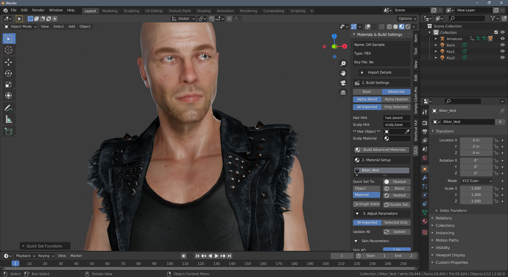

~~~~~~~
 About
~~~~~~~

Version
-------

This documentation is for version 1.3.6

Features
--------

This add-on is primarily for importing and automatically setting up materials for Character Creator 3 and iClone character exports.

Using Blender in the Character Creator 3 pipeline can often feel like hitting a brick wall.
Potentially spending hours with the import settings and setting up the material textures and shader node setup by hand.

This add-on aims to reduce that time spent getting characters into Blender down to just a few seconds and
make use of as many of the exported textures as possible so that character artists can work in the highest quality possible using Blender.

Alongside the fundamental material setup, this addon also has the following features:

- Set up and enabling of cloth physics on any clothing or hair meshes that have PhysX weight maps.

- Import OBJKey and FBXKey containing models for editing in Blender to be returned to CC (the so called *Blender Round Trip*)

- Automated creation of a Rigify control rig for the character to allow animators to work with an IK/FK rig for animation creation.

- Retargeting of armature animations from multiple sources directly onto the Rigify rig to make animation editing and adjustment much simpler.

- Retargeting of Shape Key animations from iClone to CC characters that have differing facial add-ons (brows, beards etc).

|

How it works
============

**Character Import and Material Setup**

.. admonition:: Note

    **Do Not** use the standard blender FBX importer to import characters from iClone or Character Creator.

    Instead follow the method here - :ref:`Standard Import`.

The character exports from CC3 and iClone have a very rigid naming structure. All objects and materials have unique names and the textures for these materials are stored in folders and named after the object and material names. Thus textures for each material can be easily discovered without the need for deep recursive scans for texture files.

The add-on then reconstructs the material nodes, for each object and material, using these textures and the material setup parameters as needed.

**Character Control Rigging and Animation Retargeting**

Whilst any animations included with the imported character can be played and directly edited, it is far easier to use a 'control rig' to edit or create new animations using the character. However manually setting up a control rig can be difficult and time consuming (and in the case of already animated and rigged characters a duplication of effort).  To this end, the 'Rigify' control rig has been adopted for direct automated use with Character Creator and iClone exports.

The add-on can create a Rigify rig for your character with a single button push, and then quickly and painlessly retarget any existing animations to the new rig with no loss of animation accuracy - allowing the editing of animations using the control rig. See the :doc:`animation` section for more details.

**Character Export**

Should you wish to, after modifying the character and accessories, you can re-import them back into Character Creator using the 'Character Creator - Round Trip'.

Characters can also be exported to Unity along with any animations.  This includes animations created or edited with the Rigify rig (in which case a clean export skeleton will be created with animations baked to it).

Installing
==========

- Download the **Source Code (zip)** from the `latest release from Github.com <https://github.com/soupday/cc3_blender_tools/releases>`_
- In Blender go to menu **Edit** -> **Preferences** then select **Add-ons**.
- Click the **Install** button at the top of the preferences window and navigate to where you downloaded the zip file, select the file and click **Install Add-on**.
- Activate the add-on by ticking the checkbox next to **Edit** -> **Preferences** then select **Add-ons**
- The add-ons functionality is available through the **CC3** Tab in the tool menu to the right of the main viewport. Press **N** to show the tools if they are hidden.

Removal
=======

- From the menu: **Edit**->**Preferences** then select **Add-ons**
- In the search box search **All** add-ons for **"CC3 Tools"**
- Deactivate the add-on by unticking the checbox next to **Edit**->**Preferences** then select **Add-ons**.
- Then click the **Remove** button.

Updating
========

- Remove the current version of the add-on by following the remove instructions above.
- Follow the installation instructions, above, to install the new version.