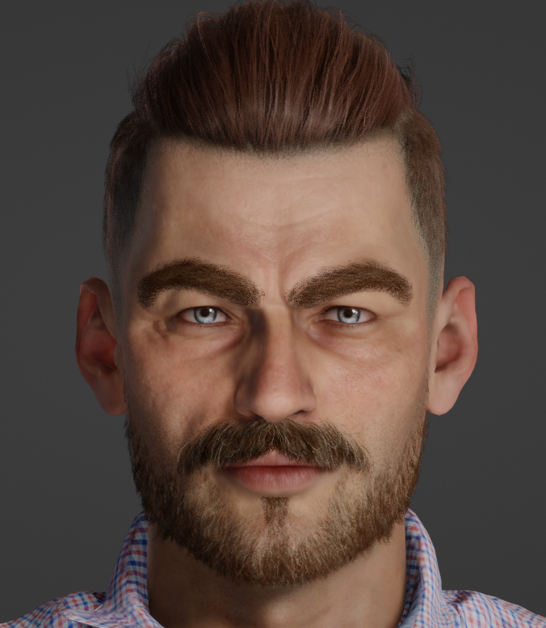
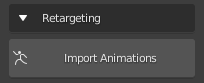
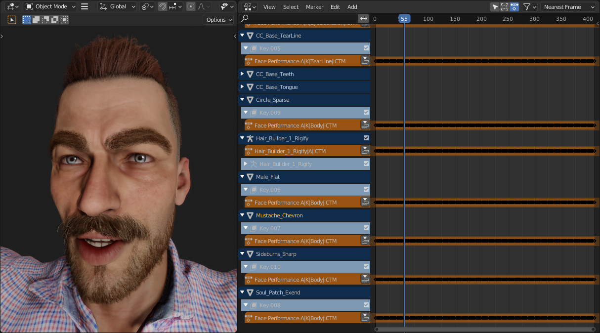

.. _Nonlinear animaton: https://docs.blender.org/manual/en/latest/editors/nla/index.html

.. |br2| raw:: html

     

.. |br| raw:: html

    

~~~~~~~~~~~~~~~~~~~~
 Advanced Animation
~~~~~~~~~~~~~~~~~~~~

Retargeting Shape Key Animation
===============================

This is a workflow outline the retargeting of Shape Key animation data from an iClone performance to a Rigified Character Creator character.  This is intended to demonstrate the utility of both the NLA and the Blender tools add-on in handling such data.

The example iClone performance has been captured below.  It is a simple combination of AccuLips viseme generation from an audio clip and direct face puppeting.  The model used deliberately omits facial hair and any other body motion.

.. figure:: images/iclone_face_performance.gif
    :align: center
    :width: 450

    *iClone Face Performance (CC3+ character)*

The example character which will be retargeted to has full facial hair and is shown below.

    *Character Creator (CC3+) character with full facial hair*

These examples will be used to illustrate some of the concepts behind the process of retargeting iClone face performances to a Rigified character in Blender.

ShapeKey Data Structure
-----------------------

If we import the face performance into Blender and examine it in the *Nonlinear Animation* editor we see the following:

.. figure:: images/nla_source.png
    :align: center
    :width: 450

    *NLA view of the face performance (Click to enlarge)*

- The armature (Face Performance A) has an armature action attached to it (renamed to include \|A\| by the add-on importer).  This action contains data to control head, neck, jaw and eye movement.

- The individual objects (CC_Base_Body etc) which comprise the character each have a Shape Key animation track attached to them (renamed to include \|K\| by the add-on importer).  These tracks contain Shape Key animation data to control facial expression, lip movement etc.

Normal armature action retargeting (see: :ref:`Retargeting Workflow`) is required to transfer the head, neck, jaw and eye movement to a Rigified character.  The Shape Key data is separately handled by an automated process which takes the source data track and applies it to any relevant object (which must contain the appropriate Shape Key definitions). Whilst this can be done by hand (using the NLA to inject new tracks using the CC_Base_Body data as a source track), it quickly becomes a messy administrative nightmare.

|

Retargeting Workflow For Shape Key Animation
============================================

Since most of this workflow is discussed in detail elsewhere links to the appropriate document sections will be provided as part of this summary.

- Firstly import the character you wish to retarget to, using the procedure for :ref:`Standard Import`.

- Follow the :ref:`Rigify Creation Workflow` to Rigify the character.

- Now export the performance from iClone (using the :ref:`iClone` procedure).

- Import the performance using the *Import Animations* button in the **Retargeting** section of the add-on.

|

- In the file dialog that appears, it is fine to leave *Remove Meshes* and *Remove Materials and Images* selected.  The Shape Key animation data will be transferred over properly.

This will give us something that looks like the image below (where the imported armature’s viewport visibility has been set to ‘In Front’ for clarity):

.. figure:: images/shapekey_import.png
    :align: center
    :width: 450

    *Rigified Character with Imported Shape Key Animation*

- With the rigified character selected, go to the **Retargeting** section of the add-on - select the imported performance as the *Source Armature* and the "iCTM" labelled action (iClone Temp Motion) as the *Source Action*.

.. image:: images/face_performance_retarget_src.png
    :align: center

|

- Preview this with the *Preview Retarget* button.  This will show the head, neck, jaw and eye movement.  If Preview Shape Keys is also selected (as default) then the Shape Key animations will also play as part of the preview.

- Use the *Bake Retarget* button to create a new Action for the Rigifed character.

- Finally use the Retarget Shape Keys button to transfer Shape Key data to the Rigified character.

- **The process is complete** for the import and retargeting of the iClone performance.

A quick render of this to a video file gives the following result (render was used for clarity, since the viewport window will play every slowly and blur detail during playback in *Material Preview* or *Rendered* mode)

.. |vid| raw:: html

    <video controls src="_static/retarget.mkv"></video> 

+ |vid|

Examining the result of the above process in the *Nonlinear Animation* editor we see the following:

    *NLA view of the face performance after retarget to a Rigified Character (Click to enlarge)*

Notable features of the retarget result are as follows:

- Newly added objects (ones that weren't present in the animation source) all take Shape Key data \|K\| from the 'Body' object of the data source.

- Wherever possible, if an object can be matched with the data source, then the applied Shape Key data will be used from that object (e.g. CC_Base_EyeOcclusion will be matched and the original EyeOcclusion data will be used).

- The armature data for head, neck etc compliments the Shape Key data and must be included for the complete performance.  Thus the *Bake Retarget* is an **essential** step.  Giving an armature Action on the Rigified character labelled \|A\|.

Because *this* example has no other body motion, then to be useful it must be combined with body animations.

This is best achieved by using Blender's `Nonlinear animaton`_ system (NLA). The NLA system in Blender is extremely powerful and can be used to combine actions, offset timings and blend between actions in an accessible way.

It is however beyond the scope of this document to fully explore the NLA system in Blender.

Full body + face performances from iClone will of course be properly retargetted and fully useable in Blender without the need for any Blender-side manipulation.