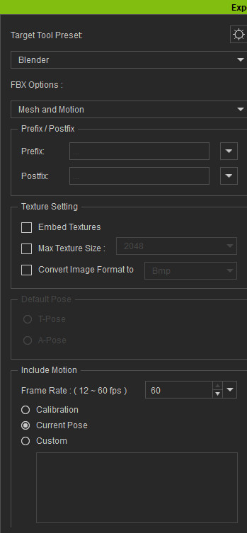
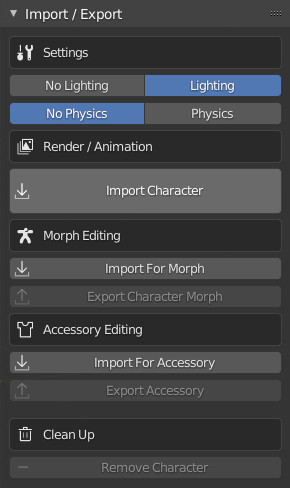

~~~~~~~~~~
 Examples
~~~~~~~~~~

First Steps
===========

- In character creator, make any character you like and dress them up.

.. image:: images/ex1_cc3_char.jpg
  :width: 600

- Export the character as **FBX (Clothed Character)**. Set the target tool preset to **Blender**, The FBX options to **Mesh and Motion**.
  You can Embed the textures if you want, but it's usually better not to as embedding the textures stores them in the FBX file
  where you can't access them if you need to.
  Set the Include Motion to **Current Pose** and tick **Delete Hidden Faces**.

- In Blender and with a new Blend file, you may need to delete the default cube.
  Press **N** to show the tools panel and select the **CC3** Tab.
  Select the **Lighting** option and then import the character by pressing the **Import Character** button under the *Render / Quality* header.
  Navigate to where you saved the exported the character from Character Creator, select the file and click the import button.

- This will import the character, set up the materials and set up some lighting similar to Character Creators default lighting to better view the character in the viewport.
  You can hide the Armature if it's getting in the way.

- Expand the **Build Settings** panel.
  Here you can change the way the add-on builds the materials, select any imported object and
  quickly adjust the build object type and material type as well as the alpha blend settings on any object material.

  The add-on attempts to detect the type and purpose of each object and material by analysing the object and material names for certain keywords.
  Sometimes it gets this process wrong if the objects or materials have ambiguous names, but the detected settings can be corrected:

  - The **Object Type** allows you to specify what type of object and thus how to build the materials for that object.
  - The **Material Type** similarly allows you to specify what type of material.
  - These two settings will allow you to correct any mis-detected materials in the import. Typically only hair and clothing meshes will
    be wrongly detected sometimes.

- Expand the **Material Parameters** panel.
  The material parameters control how the various textures of the character interact and mix together to form the final appearance of the character.
  Each parameter can be adjusted and the materials will update in real time as you change the parameter sliders.
  For the most part these parameters take the same values as the material shader parameters in Character Creator 3.
  The parameters displayed are context sensitive to the currently active selected object and material.
  Full details of the material parameters can be found here: :doc:`materials`.

