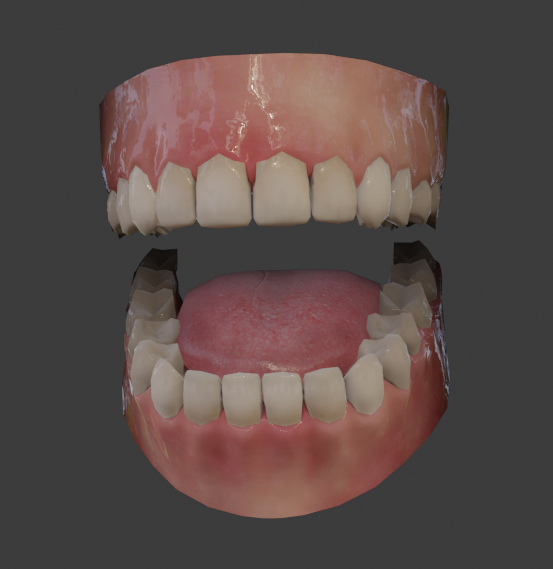
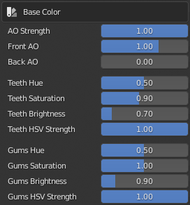
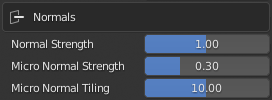
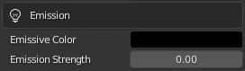
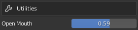

.. |br2| raw:: html

     

.. |br| raw:: html

    

########################
 Teeth, Gums and Tongue
########################

    *Mouth Components*

*******************************
Teeth, Gums & Tongue Parameters
*******************************

Teeth & Gums
============

.. image:: images/teeth_mat_sel.png
    :align: right

Teeth & Gums parameters are defined in the *Std_Upper_Teeth* and *Std_Lower_Teeth* materials in the **CC_Base_Teeth** object.  These parameters can be adjusted simultaneously as :ref:`linked materials<Linked Materials>`.

|

**Base Color**

.. |txtgt1a| replace::
    X

.. list-table::
   :widths: 2 3
   :header-rows: 0

   * - |imtgt1|
     - |txtgt1a|
       |br2|

**Surface**

.. |txtgt2a| replace::
    X

.. list-table::
   :widths: 2 3
   :header-rows: 0

   * - |imtgt2|
     - |txtgt2a|
       |br2|

**Subsurface**

.. |imtgt3|
    image:: images/teeth_gums_subsurface.png

.. |imtgt3a|
    image:: images/teeth_gums_subsurface_vector.png

.. |txtgt3a| replace::
    X

.. list-table::
   :widths: 2 3
   :header-rows: 0

   * - |imtgt3|
     - |txtgt3a|
       |br2|
       |imtgt3a|

**Normals**

.. |txtgt4a| replace::
    X

.. list-table::
   :widths: 2 3
   :header-rows: 0

   * - |imtgt4|
     - |txtgt4a|
       |br2|

**Emission**

.. |txtgt5a| replace::
    X

.. list-table::
   :widths: 2 3
   :header-rows: 0

   * - |imtgt5|
     - |txtgt5a|
       |br2|

**Utilities**

.. |txtgt6a| replace::
    X

.. list-table::
   :widths: 2 3
   :header-rows: 0

   * - |imtgt6|
     - |txtgt6a|
       |br2|