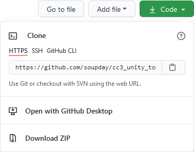
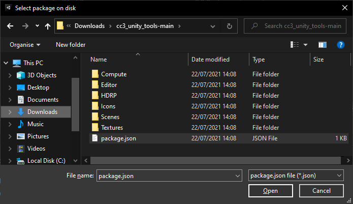
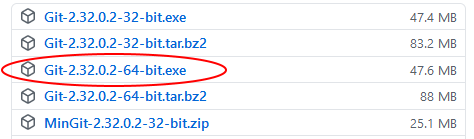
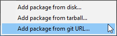
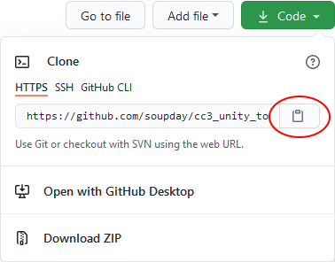

..
    all external links referenced here
.. _git repository: https://github.com/soupday/cc3_unity_tools_HDRP
.. _git URL: https://github.com/soupday/cc3_unity_tools_HDRP.git
.. _latest release: https://github.com/soupday/cc3_unity_tools_HDRP/releases/
.. _Unity: https://unity.com/
.. _Reallusion: https://www.reallusion.com/
.. _7zip: https://www.7-zip.org/
.. _git for windows: https://github.com/git-for-windows/git/releases/tag/v2.32.0.windows.2

~~~~~~~~~~~~~~
 Installation
~~~~~~~~~~~~~~

Hosting at Github
=================

The tool is hosted in this `git repository`_, and is intended to be installed into **Unity 2020.3 or above** using Unity's internal package manager.

To obtain most recent stable version follow this link to the `latest release`_, and download the **source code.zip** file from there.

Alternatively, you can obtain the latest commit to the stable branch by pressing the green 'Code' button and then 'Download Zip' from the dropdown window. Alternatively the code can be cloned directly from github via HTTPS using the `git URL`_ which can be copied from the dropdown window (discussed later).

Installation from .zip file
===========================

Download the `latest release`_ or latest stable commit (from the code dropdown box). Unpack the .zip file (`7zip`_ is a suitable tool for this, should you lack one).

In Unity, open your project and navigate to the 'Package Manager' (*via* **Window -> Package Manager**).

.. image:: images/package_manager.png

Now click the 'Add' button.

And select 'Add package from disk'.

.. image:: images/add_from_disk.png

Navigate to the place where you unpacked the .zip file and select package.json.

The package manager will now install the tool and will end up looking like this.

.. image:: images/post_install_package.png

The tool is fully installed and ready to be used.  The files you extracted earlier can safely be deleted.

Installation from git URL
=========================

**Pre-requisites**

Packages can be installed into Unity directly from a git repository.

The sole requirement for this is that Unity must be able to find the **git.exe** executable somewhere on your PATH.

If you require a git executable you can install `git for windows`_ (download the 64bit windows installer and accept all the default options when installing).

Please make sure you **restart Unity and Unity Hub** after installing git for windows otherwise you will encounter the following error.

**Installing from Github**

Open the Unity package manager **Window -> Package Manager**, click the add (+) button and select 'Add package from git URL'.

Copy the URL from the green code dropdown box in the `git repository`_.

Paste this into the package manager and click 'Add'.  The package manager will now install the tool.

Removal
=======

Open the Unity package manager (**Window -> Package Manager**) highlight the package that you wish to remove and click the remove button.