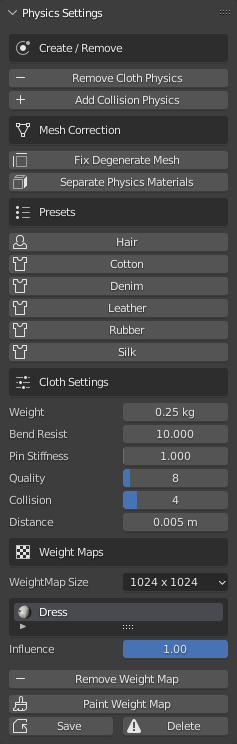
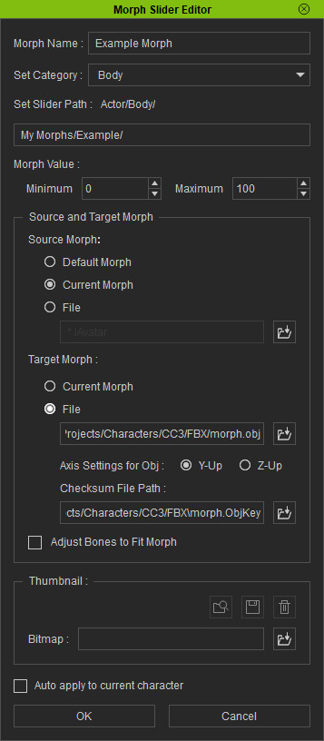
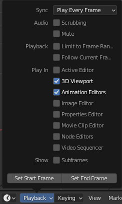

.. _Cloth Physics: https://docs.blender.org/manual/en/latest/physics/cloth/index.html

.. _Collision Physics: https://docs.blender.org/manual/en/latest/physics/collision.html

~~~~~~~~~~~~~~~~
 Advanced Usage
~~~~~~~~~~~~~~~~

Importing with Physics
======================

Importing
---------

.. image:: images/physics_selected.png

When the *Physics* option is selected in the **Import/Export** panel then when the character is imported, *cloth physics*, *vertex groups* and *modifiers* will be automatically generated for any of the mesh objects & materials that have PhysX weight maps. All of which can be changed at will should you need to.

Thus, to import a character with physics enabled (highlighted blue), in the **Import/Export** panel follow the procedure for :ref:`Standard Import` (do not use the standard fbx importer for this).

.. admonition:: Important Consideration For Cloth Simulation

  Always allow Blender to compute the full range of frames for any cloth simulation by playing the whole animation through with no :ref:`frame dropping`.
  
  This will be initially slow; however this **must** be done in order to cache the cloth calculations.

  Once this is done you may then spool through the animation or enable :ref:`frame dropping` to get closer to real time playback (as much as Blender allows before requiring a re-calculation).
  
  Failure to do this will cause the cloth simulation to break and behave erratically.

Settings
--------

The **Physics Settings** panel contains a comprehensive set of controls to adjust the physics parameters of the currently selected object.

**Create/Remove**

- Add/Remove Cloth Physics: This will add or remove a `Cloth Physics`_ modifier on the selected object.  This enables/disables full cloth simulation.

- Add/Remove Collision Physics: This will add or remove a `Collision Physics`_ modifier on the selected object.  Which will allow cloth objects to collide with mesh objects.

**Mesh Correction**

- Fix Degenerate Mesh: This will remove degenerate mesh elements from the mesh - this include loose vertices, orphaned edges, zero length edges etc.  The presence of these elements may cause problems with simulation.

- Separate Physics Materials: This will separate the object by material and apply physics to the separated objects that have weight maps.  This may increase performance where only a small part of an object is simulated.

**Presets**

This will impose physics settings on the object that approximate the behavior of the named material (Cotton, Silk etc).

**Cloth Settings** and **Collision Settings** are the standard physics settings used by Blender in the *Physics Properties* of the standard *Properties* pane (only presented here for user convenience -  only visible when cloth or collision physics have been applied to the object).

The example below shows a standard 'Silk' preset applied to a dress object during an animation (mesh highlighted for clarity).

.. figure:: images/dress_physics.gif
  :align: center

  *Standard Silk Simulation*

.. admonition:: Hair Physics

  Whilst early versions of hair from Character Creator have properly defined physics properties, certain newer ones may not simulate correctly.  Smart Hair should now simulate correctly (as of version 1.3.6).

|

Morph Editing
=============

This section is to facilitate creating character morph sliders for Character Creator. The typical process is to import a character,
adjust the mesh, with the mesh editing and sculpting tools, for the shape of the morph. Then export the new mesh
back to Character Creator to be made into a morph.

There are two main ways of achieving this. One is with an FBX character export, the other with an OBJ character export.
The procedures for exporting and subsequent re-importing are different for each.

Character Creator also requires that an **FbxKey** or **ObjKey** must be generated by the export process and used in the re-import process.
This key is uniquely generated for each character export and is conditional on certain export settings.

Exporting a Character FBX with FbxKey (From Character Creator)
--------------------------------------------------------------

Export from the file menu: **File** -> **Export** -> **FBX (Clothed Character)**

.. image:: images/export_fbx_menu.jpg

With the options:

- Target Tool: *Blender*
- FBX Options: *Mesh*
- Texture Settings: *Any*
    - Generally best not to embed textures.
    - *Do not convert to BMP*
- Default Pose: *Any*

.. image:: images/export_fbx_morph_options.jpg

Exporting a Character OBJ with ObjKey (From Character Creator)
--------------------------------------------------------------

Export from the file menu: **File** -> **Export** -> **OBJ** -> **Nude Character in Bind Pose**

.. image:: images/export_obj_nude_menu.jpg

With the default options:

.. image:: images/export_obj_nude_options.jpg

The **Nude Character in Bind Pose** export does not generate any materials, which means that
the import into Blender will have no textures.

Import For Morph Editing
------------------------

Perform a :ref:`Standard Import` of the exported character without animation; also Physics should *not* be applied for morph creation.

If an **FbxKey** or **ObjKey** file is present (created using either of the processes outlined above) then the character is suitable for editing with subsequent export back to Character Creator.  

In the absence of a suitable Fbx or Obj Key the *Export to CC3/4* function will be unavailable.

..
    This button will import the character with the best settings for making character morphs.
    Specifically the character is imported without animation, in the bind pose, and requires the presence of an **FbxKey** or **ObjKey** file
    as described in the export procedures above.
    A warning message will be displayed if there isn't one.

    Optional lighting can be set up. Physics should *not* be applied for morph creation.

Export Character Morph
----------------------

Once you have altered the character to your satisfaction you can export it back to Character Creator using the *Export to CC3/4* button in the **Exporting** pane of the add-on.

Importing a Character FBX with FbxKey (Back into Character Creator)
-------------------------------------------------------------------

Import from the File menu: **File** -> **Import...**

Find and select the FBX file exported from Blender.

Before the import begins you should be presented with the "Create Assets" window. It should have the **Decrypt Key**
(i.e. the **FbxKey**) automatically filled in as it is copied with the FBX export.

.. image:: images/import_fbx_key_options.jpg

Press OK to continue the import. After a while you should be presented with a status report window summarizing the contents.
Any problems with the import will be displayed here.

If this fails with a decrypt key warning, this means that the character body mesh is not the same topology as was originally
exported from Character Creator. There can be **no** changes to the mesh vertex structure or order. You can deform the mesh as much as you like
but you cannot add or remove **any** vertices or faces from the character body mesh. Some Blender modifiers may also re-arrange the vertex order
and make the mesh invalid.

Press OK and the import process will complete.
Note: The import character process does not re-import the textures and you will be left with an textureless character.
However you can still make morph sliders from this character.

**Create** -> **Head & Body Morph Sliders**

.. image:: images/import_create_head_body_slider.jpg

And this will create a full body head/body slider you can apply to the neutral character base.

Importing a Character OBJ with ObjKey (Back into Character Creator)
-------------------------------------------------------------------

This time we import from the Create menu: **Create** -> **Morph Slider Editor**

.. image:: images/import_slider_editor.jpg

Here we create a morph slider directly from the OBJ file.

- You can select the default morph as the source morph to create a full body morph for the neutral base.
- Or you can select the current morph as the source morph to create a morph relative to your current character.
- In the target morph, select the OBJ file exported from Blender.
  The **Checksum File** (i.e. the **ObjKey**) should be filled in automatically as it is copied during the export.

|

Accessory Editing
=================

Export Accessory
----------------

.. image:: images/export_accessory.png

Exports the selected object as an accessory for Character Creator.  This does of course require you to make your own model.

|

Frame Dropping
==============

Frame dropping during playback is a convenient means of viewing real time playback of the animation.  This does have some limitations.

- Playback of Blendshape animation may be erratic in a Material Shaded or Rendered Viewport.

- Initial playthrough of Cloth Simulations will be entirely broken.

To enable or disable frame dropping: In a **Timeline** window, click on the *Playback* dropdown.

In the *Sync* section click the dropdown and choose whichever *Sync Mode* you require.

.. image:: images/timeline_sync_mode.png

**NB** Remember to reset this to 'Play every frame' in order to properly re-calculate cloth simulations.