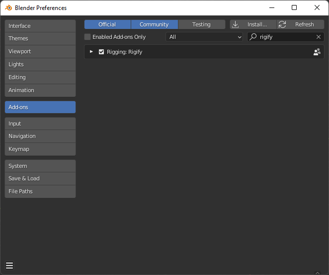
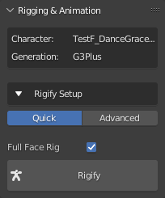
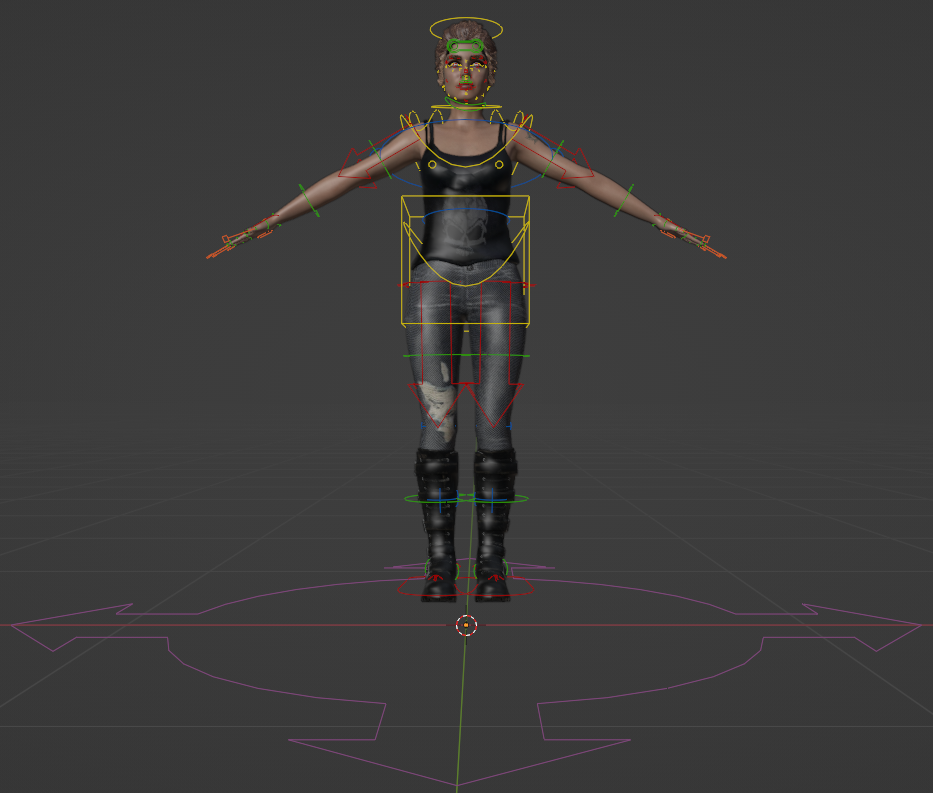
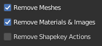
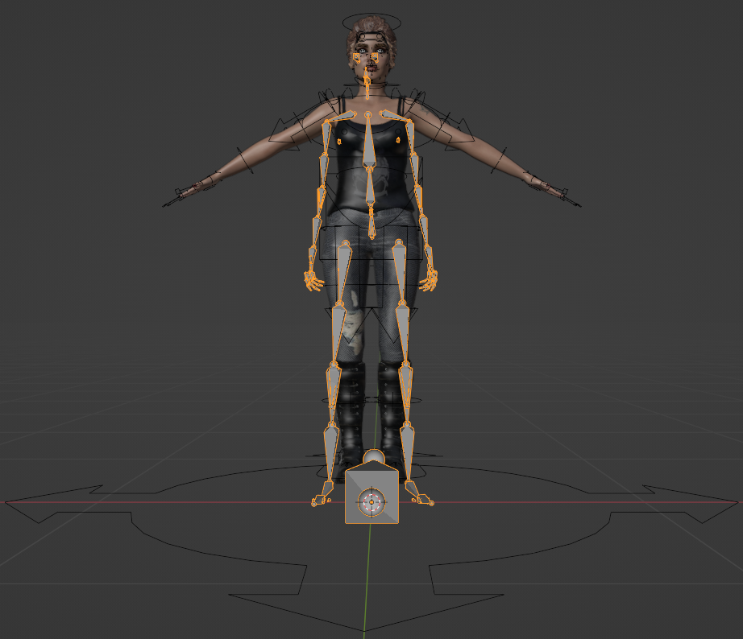
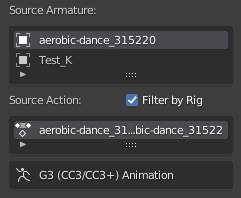
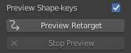
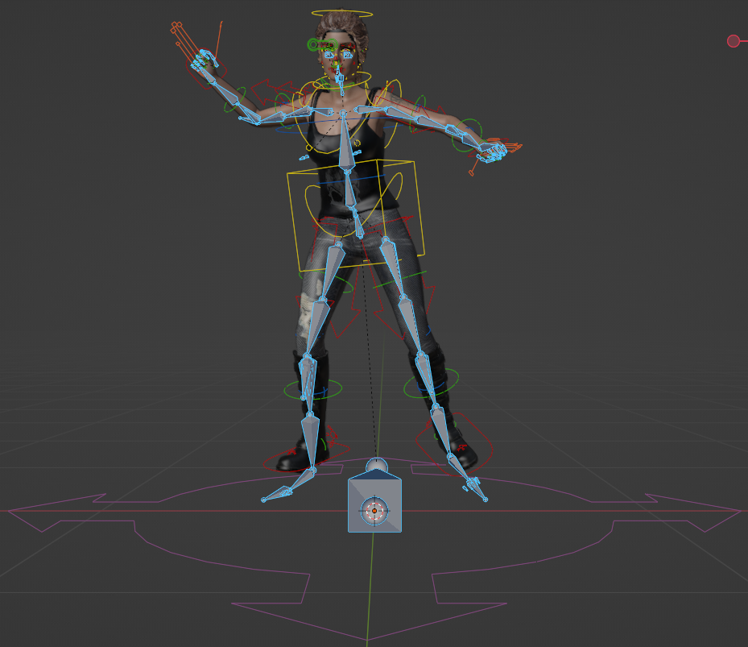
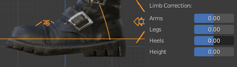
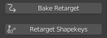

.. _Blender actions: https://docs.blender.org/manual/en/latest/animation/actions.html

.. _Rigify: https://docs.blender.org/manual/en/2.81/addons/rigging/rigify.html

.. |br2| raw:: html

     

.. |br| raw:: html

    

~~~~~~~~~~~
 Animation
~~~~~~~~~~~

Introduction.
=============

Characters imported into Blender from either Character Creator or iClone using the :ref:`Standard Import` which have animation track(s) will have those animations imported as separate `Blender actions`_.

These skeletal animations can be directly edited using Blender, however this can often be a difficult process.  A more popular means of animation editing/creation is to use a *Control Rig* which allows easy posing and manipulation of the character using simple controls.

Since version 2.79 (2017) Blender ships with the excellent `Rigify`_ control rigging tool.  To make use of it, we must consider the following.

- The basic workflow for Rigify involves using a T-posed model and generating a *Meta-Rig* which then has it's pose manually matched to the T-pose of the model.  This is then used to automatically generate the *Rigify Rig* and weight paint the model for use with that Rigify Rig - which can then be used to create animations.

- The characters imported from Character Creator and iClone are *already* rigged and weighted and are cross compatible with the extensive animation library for CC/iClone/ActorCore.  Re-rigging would therefore break compatibility with existing animations and destroy carefully weight painted items.

To overcome the issues highlighted above, the process of generating the Rigify Rig for CC/iClone characters has been fully automated and the only user input required is to press the button.  Simple tools to convert imported animations for use with the Rigify Rig are also provided.  These tools can currently convert ActorCore/GameBase/Character Creator/iClone animations from Reallusion and Mixamo's XY Bots and General Human animations.

As an example, the .gif displayed below is a Character Creator character with a native animation which has been 'rigified' and the animation retargetted onto the rigify rig.

.. figure:: images/dance_rigify.gif
    :align: center

    *Rigified CC character with animation applied to Rigify Rig*

The complete Rigify workflow for Character Creator characters is discussed below.

|

Creating a Rigify Control Rig
=============================

Pre-requisites
--------------

In addition to having the CC Blender Tools add-on installed and activated (see the :ref:`Installing` section for details), the Rigify add-on must also be enabled (in a default installation of Blender, it is disabled by default). To enable Rigify, navigate to *Edit -> Preferences* to bring up the 'Blender Preferences' window, click the *Add-ons* button and enter "rigify" in the search field; ensure that the *Rigging:Rigify* checkbox has a tick in it.  The preferences should auto-save - if not click on the *'Save & Load'* button |save_load| and choose *'Save Preferences'*.

|

Rigify Creation Workflow
------------------------

Once a character has been imported using the :ref:`Standard Import` procedure (with the *Import Animation* checkbox in the *file view* active as per default) then the character can be automatically *Rigified* as follows:

- Open the **Rigging and Animation** dropdown to show the initial controls.  Please make sure at this point that the character you wish to work with is named in the *Character* info text.

- |init_rigify| |br2|

- Full Face Rig is selected by default - deselecting it will omit the very complex and versatile facial rig leaving only the main skeletal rig.

- The Rigify process is completed by clicking the **Rigify** button.  This will create a new rig with all of the necessary controls and constraints.  The original skeleton will be left in the hierarchy (deselected and hidden).

- The character will then be presented in a A-Pose with all the standard Rigify controls available (show here in *Pose Mode*).

    *Rigified character*

.. Tip:: 
    The Rigify process is complete.  The control rigged character can now be used to create animations.  Any animations that were imported with the original character **must** now be retargeted to the new control rig **before** they can be used.

|

Retargeting Animations to the Rigify Control Rig
=================================================

A wide range of animation sources can be retargeted directly to the Rigify Control Rig.  These are as follows:

From **Reallusion**

- Character Creator

- ActorCore

- GameBase

- iClone

From **Mixamo** (Experimental)

- XY Bots

- General Humans

Retargeting Workflow
---------------------

Import
______

To retarget animations, they must first be present in the .blend file you are working with.  Animations may have been imported along with the character that has been rigified and as such can be processed directly. Or, they can be imported from other external .fbx files.

Animation import can be performed using the *Import Animations* button.

.. image:: images/retarget_import.png

This will bring up a file dialog which has some extra settings that will remove meshes and materials from the animation import. i.e. only the armature with its' associated actions including shapekey actions; this greatly cuts down excess clutter in the .blend file.

.. Tip::
    The *Import Animations* function also has the ability to perform multiple animation imports in a single operation (limited to the .fbx files being in the same directory). By simply multiple selecting the source files you want to import.

.. Admonition:: Note on naming conventions

    When the import animations function is used, it will automatically rename the animation action to the following form:

    Source Filename \| <Type> \| Animation Clip Name

    where <Type> can be A for Armature, and K for Key (the name ShapeKey animations are by default imported with).

    For the animation name, iClone's TempMotion is abbreviated to iCTM.

Imported armatures will appear in the scene as shown below (shown here with an imported ActorCore animation - where the imported armature's viewport visibility is set to 'In Front' for clarity):

    *Rigified character with imported armature*

|

Retargeting
___________

Once animations are imported (or are already present from your original character) then they can be easily retargeted using the following procedure:

- Select the Source Armature.

- Select the animation action on that source armature (by default the actions list is filtered by the selected armature).

- |anim_source| |br2|

- Note that the animation source has also been identified (in this example as a Gen 3 CC3/CC3+ Animation)

- The selected action can be live previewed on the rigified character.  If you wish to omit any Shape Key animations from the preview then uncheck the *Preview Shape Keys* checkbox. To begin the preview click on the *Preview Retarget* button.

- |preview_controls|

    *Rigified character previewing retargeted animation*

- During the live preview, several aspects of the animation can be adjusted:  the spread of the arms, the spacing of the legs, the angle of the heel *and* toe (**shown below** - used to compensate for changes to footwear) and the root height of the animation (again useful for changes in footwear and in scale).

- |limb_correction| |br2|

- Once you are happy with the corrections and the preview, then you can bake the animation (including the corrections) to a new action using the *Bake Retarget* button.

- |bake_retarget| |br2|

- If you wish to apply a Shape Key animation to the current character then press the *Retarget Shape Keys* button.  This will apply the Shape Key animation to all of the objects in the character that have the same Shape Keys available - thus facial hair will be properly animated irrespective of there being any facial hair on the animation source.  This is discussed more fully in the :ref:`Retargeting Shape Key Animation` section of the documentation.

- **The process is complete** for this Action, perform this procedure for as many actions as you require.

.. Tip::
    Baked animations are created and stored in the Blender *Action Editor* with the following naming convention:

    Rigified Char Name \| <Type> \| Animation Clip Name

    Multiple actions are perhaps best managed with the NLA editor (especially Shape Key animations).

.. figure:: images/side_by_side_actorcore.gif
    :align: center

    *Retargeted Rigified CC+ Char playing alongside the Original ActorCore Motion Dummy and Animation used in the above example workflow*

