.. _Blender documentation: https://docs.blender.org/manual/en/latest/render/shader_nodes/shader/principled.html

.. _displacement modifier: https://docs.blender.org/manual/en/latest/modeling/modifiers/deform/displace.html

.. _sclera: https://en.wikipedia.org/wiki/Sclera

.. _iris: https://en.wikipedia.org/wiki/Iris_(anatomy)

.. _limbus: https://en.wikipedia.org/wiki/Corneal_limbus

.. _Hue Saturation Value Node: https://docs.blender.org/manual/en/latest/compositing/types/color/hue_saturation.html

.. _HSV color model: https://en.wikipedia.org/wiki/HSL_and_HSV

.. _SSS in the Eevee render engine: https://docs.blender.org/manual/en/latest/render/eevee/limitations.html#eevee-limitations-sss

.. _`Multiplier`: https://docs.blender.org/manual/en/latest/render/shader_nodes/shader/principled.html#inputs

.. _`Index of Refraction`: https://en.wikipedia.org/wiki/Index_of_refraction

.. |br2| raw:: html

     

.. |br| raw:: html

    

######
 Eyes
######

***************
Eye Composition
***************

The eyes and the surrounding area have a large amount of detail and flexibility.  The following are the "eye relevant" parts of the character model.

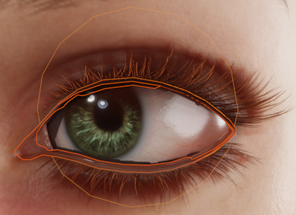

    *Eye Objects*

* :ref:`Eye Occlusion<Eye Occlusion>` - defined by the *Std_Eye_Occlusion_R & _L* materials in the **CC_Base_EyeOcclusion** object.
* :ref:`TearLine<TearLine>` - defined by the *Std_Tearline_R & _L* materials in the **CC_Base_TearLine** object.
* :ref:`Eyeball<Eyeball>` - defined by the *Std_Eye_R & _L and Std_Cornea_R & _L* in the **CC_Base_Eye** object.
* :ref:`Eyelashes<Eyelash>` - defined by the *Std_Eyelash* material in the **CC_Base_Body** object.

The parameters for each of the materials can be manipulated in the *Material Parameters* dropdown of the tool *via* the selection of the relevant object and the selection of the material from the *Material Properties* tab of the *properties* pane.  This is discussed in more detail :ref:`here <Examining Material Parameters>`.

|

**************
Eye Refraction
**************
..
    Approximated Parallax Refraction in a single cornea material which is not subject to Eevee limitations on Subsurface scattering and receiving shadows.
    Screen Space Refraction with a transmissive & transparent cornea material over an opaque eye (iris) material. SSR Materials do not receive full shadows and cannot have subsurface scattering in Eevee.

There are two types of *eye refraction* available (summarized below)

* *Parallax* - *Approximated Parallax Refraction* using a single cornea material.  In the Eevee render engine this material **allows** both **Sub-Surface Scattering** and **Receiving Shadows**

.. figure:: images/eye_parallax.gif
    :align: center
    :width: 400
    :alt: Parallax

    *Parallax Refraction*

* *SSR* - *Screen Space Refraction* using a transmissive and transparent cornea material over an opaque iris material.  In the Eevee render engine this material **cannot have Sub-Surface Scattering** and **cannot receive full shadows**

.. figure:: images/eye_ssr.gif
    :align: center
    :width: 400
    :alt: Screen Space Refraction

    *Screen Space Refraction*

When the character is imported, the *Parallax* materials are built by default.  If you wish to switch to *SSR* materials then navigate to the *Build Settings* dropdown of the tool and find the section called *Eye Refraction*.

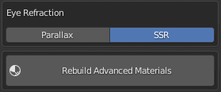

    *Eye Refraction Settings with SSR selected*

Select the type of refraction required and then click *Rebuild Advanced Materials*.

|

**************
Eye Parameters
**************

Eye Occlusion
=============

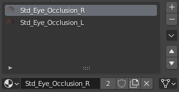

Eye Occlusion parameters are defined in the *Std_Eye_Occlusion_R* and *Std_Eye_Occlusion_L* materials in the **CC_Base_EyeOcclusion** object.  These parameters can be adjusted simultaneously as :ref:`linked materials<Linked Materials>`.

|

**Base Color & Opacity**

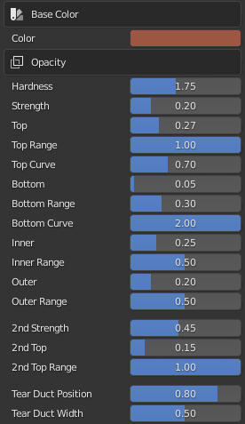

.. |txe2a| replace::
    *Hardness* - Eye occlusion alpha channel *exponent*.  Note: Small :ref:`exponent<Exponent Effects>` values will tend to raise all the values in the alpha map towards 1 and as such cause the whole eye occlusion to become more opaque whereas larger values will give less opacity.

.. |txe2b| replace::
    *Strength* - Multiplier applied to the to the primary occlusion mask to control the overall strength of the mask.

.. |txe2c| replace::
    *Top / Top Range / Top Curve* - These values control the *UV* gradient for the top of the eye.  Where *Top* determines the minimum distance of occlusion from the top of the eye (where larger values will occlude more of the eye in a downward direction); *Top Curve* determines the curvature of the occlusion; *Top Range* determines the maximum extent of the occlusion (max 1.0).

.. |txe2d| replace::
    *Bottom / Inner / Outer* - These controls work analogously to the above but for the bottom of the eye (occluding upwards); the inner eye (occluding from the tear duct across the eye) & the outer eye (occluding inwards towards the tear duct). 

.. |txe2e| replace::
    *2nd Strength / 2nd Top / 2nd Top Range* - These values control a secondary occlusion mask which occludes from the top down;  Strength operates as above  however the sense of the 2nd mask is inverted so small values will occlude more (in a downward direction from the top of the eye). 

.. |txe2f| replace::
    *Tear Duct Position / Width* - These values control the beginning of the occlusion from the tear duct side of the eye.

.. list-table::
   :widths: 2 3
   :header-rows: 0

   * - |ime2|
     - |txe2a|
       |br2|
       |txe2b|
       |br2|
       |txe2c|
       |br2|
       |txe2d|
       |br2|
       |txe2e|
       |br2|
       |txe2f|

**Displacement**

.. |ime3|
    image:: images/mat_param_eye_occlusion_disp.png

.. |txe3a| replace::
    *Displace / Top / Bottom / Inner / Outer* - These values determine the shape of the eye occlusion object iteself.  
    
.. |txe3b| replace::
    Each value controls the strength of a blender `displacement modifier`_ for the appropriate vertex group relating to the named part of the mesh.

.. list-table::
   :widths: 2 3
   :header-rows: 0

   * - |ime3|
     - |txe3a|
       |br2|
       |txe3b|

|

TearLine
========

.. image:: images/tear_line_mat_selection.png
    :align: right

TearLine parameters are defined in the *Std_Tearline_R* and *Std_Tearline_L* materials in the **CC_Base_Tearline** object.  These parameters can be adjusted simultaneously as :ref:`linked materials<Linked Materials>`.

|

|

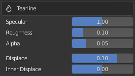

.. |txe4a| replace::
    *Specular* - Controls the amount of specular reflection.

.. |txe4b| replace::
    *Roughness* - Controls the surface roughness for diffuse and specular reflection.

.. |txe4c| replace::
    *Alpha* - Controls the transparency of the tear line.

.. |txe4d| replace::
    *Displace / Inner Displace* - control the shape of the tearline object using a `displacement modifier`_ for each appropriate vertex group.

.. list-table::
   :widths: 2 3
   :header-rows: 0

   * - |ime4|
     - |txe4a|
       |br2|
       |txe4b|
       |br2|
       |txe4c|
       |br2|
       |txe4d|

|

Eyeball
=======

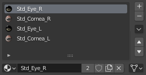

TearLine parameters are defined in the *Std_Eye_R*, *Std_Eye_L*, *Std_Cornea_R* and *Std_Cornea_L* materials in the **CC_Base_Eye** object.  These parameters can **all** be adjusted simultaneously as :ref:`linked materials<Linked Materials>`.

|

**Base Color**

.. |ime5|
    image:: images/mat_param_eyeball_base_color.png

.. |txe5a| replace::
    *AO Strength* - :ref:`Blending Factor<Blending Factor>` controls the multiply blending of the AO map over the eye color map.

.. |txe5b| replace::
    *Color Blend* - :ref:`Blending Factor<Blending Factor>` controls the multiply blending of the color blend map (effectively controlling edge darkening) over the combined iris and limbus color map (giving the eye color map which is then AO blended, as above).

.. |txe5c| replace::
    *Sclera Hue, Saturation and Brightness* - These are respectively the Hue, Saturation and Value parameters of the standard `HSV color model`_; applied to the `sclera`_ of the eye.

.. |txe5d| replace::  
    *Sclera HSV* - This is a control factor for a blender '`Hue Saturation Value Node`_' to control the influence of the *Sclera Hue, Saturation and Brightness* values defined above.
    
.. |txe5e| replace::
    *Iris Hue, Saturation and Brightness* - These are respectively the Hue, Saturation and Value parameters of the standard HSV color model; applied to the `iris`_ of the eye.

.. |txe5f| replace::  
    *Iris HSV* - This is a control factor for a blender '`Hue Saturation Value Node`_' to control the influence of the *Iris Hue, Saturation and Brightness* values defined above.

.. |txe5g| replace::
    *Iris radius* - Controls the size of the `iris`_.

.. |txe5h| replace::
    *Limbus Width, Dark Radius/Width & Limbus Color* - Collectively these control the `limbus`_ region of the eye (more specifically these values influence the size and strength of the dark region between the iris and sclera).

.. list-table::
   :widths: 2 3
   :header-rows: 0

   * - |ime5|
     - |txe5a|
       |br2|
       |txe5b|
       |br2|
       |txe5c|
       |br2|
       |txe5d|
       |br2|
       |txe5e|
       |br2|
       |txe5f|
       |br2|
       |txe5g|
       |br2|
       |txe5h|

**Eye Shape**

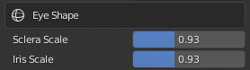

.. |txe6a| replace::
    *Sclera Scale* - Scaling factor for the sclera texture (effectiveley controls the visibility of blood vessels). 

.. |txe6b| replace::
    *Iris Scale* - Controls the size of the iris (incorporating of the limbus settings in the above section).

.. list-table::
   :widths: 2 3
   :header-rows: 0

   * - |ime6|
     - |txe6a|
       |br2|
       |txe6b|

**Corner Shadow**

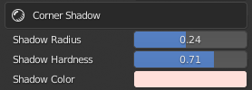

.. |txe7a| replace::
    *Shadow Radius* -  Radius of an circular inverse shadow mask, which at low values will draw shadow over the corners of the eye (at very small values it will shadow the entire eye).

.. |txe7b| replace::
    *Shadow Hardness* -  Hardness of the edge of the shadow mask (values towards 1.0 will draw a very sharp line).

.. |txe7c| replace::
    *Shadow Color* -  Color of the shadow.

.. list-table::
   :widths: 2 3
   :header-rows: 0

   * - |ime7|
     - |txe7a|
       |br2|
       |txe7b|
       |br2|
       |txe7c|

**Surface**

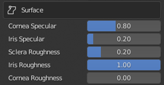

.. |txe8a| replace::
    *Cornea / Iris Specular* -  Controls the amount of specular reflection in the Cornea and Iris respectively.

.. |txe8b| replace::
    *Sclera / Iris / Cornea Roughness* -  Controls the surface roughness for diffuse and specular reflection in the Sclera, Iris and Cornea respectively.

.. list-table::
   :widths: 2 3
   :header-rows: 0

   * - |ime8|
     - |txe8a|
       |br2|
       |txe8b|

**Subsurface**

.. |ime9|
    image:: images/mat_param_eyeball_subsurface.png

.. |txe9a| replace::
    *Subsurface Scale* -  `Multiplier`_ for the *'Subsurface Radius Vector'* constructed below.

.. |txe9b| replace::
    *Subsurface Radius and Falloff* - These are combined to give a vector which controls the subsurface scattering radius for each color, as with the skin subsurface:

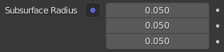

.. |txe9c| replace::
    *'Subsurface Radius Vector'* in the material surface properties.  This is used to bypass limitiations of `SSS in the Eevee render engine`_.
    
.. list-table::
   :widths: 2 3
   :header-rows: 0

   * - |ime9|
     - |txe9a|
       |br2|
       |txe9b|
       |br2|
       |ime9b|
       |br2|
       |txe9c|

**Depth and Refraction**

.. |ime10|
    image:: images/mat_param_eyeball_depth.png

.. |txe10a| replace::
    *Iris Depth* - Controls the depth of the iris (using a blender displacement modifier of the relevant vertex group).

.. |txe10b| replace::
    *Depth Radius* - Controls the radius of influence of the depth control.

.. |txe10c| replace::
    *Pupil Scale* - Controls the texture scaling of the pupil and surrounding iris.

.. |txe10d| replace::
    *IOR* - '`Index of Refraction`_' of the eye.  For reference water has a refractive index :math:`n` = 1.333 and diamond has :math:`n` = 2.417.

.. |txe10e| replace::
    *Refraction Depth* - Controls the apparent depth of the refracting medium.

.. list-table::
   :widths: 2 3
   :header-rows: 0

   * - |ime10|
     - |txe10a|
       |br2|
       |txe10b|
       |br2|
       |txe10c|
       |br2|
       |txe10d|
       |br2|
       |txe10e|

**Normals**

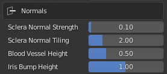

.. |txe11a| replace::
    *Sclera Normal Strength* - Multiplier to control the strength of the sclera normal map.

.. |txe11b| replace::
    *Sclera Normal Tiling* - UV tiling size of teh sclera normal map.

.. |txe11c| replace::
    *Blood Vessel Height* - Bump map strength for blood vessels in the sclera diffuse map.

.. |txe11d| replace::
    *Iris Bump Height* - Control for the overall distance for bump mapping.
        
.. list-table::
   :widths: 2 3
   :header-rows: 0

   * - |ime11|
     - |txe11a|
       |br2|
       |txe11b|
       |br2|
       |txe11c|
       |br2|
       |txe11d|      

**Emission**

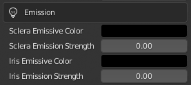

.. |txe12a| replace::
    *Sclera Emission Color* - Emissive color of the sclera to be multiplied with an exported emission map.

.. |txe12b| replace::
    *Sclera Emission Strength* - Multiplier applied to the emissive color map.

.. |txe12c| replace::
    *Iris Emission Color* - Emissive color of the iris to be multiplied with an exported emission map.

.. |txe12d| replace::
    *Iris Emission Strength* - Multiplier applied to the emissive color map.

.. list-table::
   :widths: 2 3
   :header-rows: 0

   * - |ime12|
     - |txe12a|
       |br2|
       |txe12b|
       |br2|
       |txe12c|
       |br2|
       |txe12d|      

Eyelash
=======

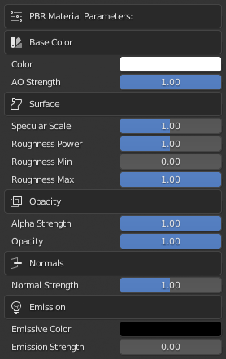

.. |txe1a| replace::
    The *Std_Eyelash* material is part of the **CC_Base_Body** object and is a standard PBR Material.

.. list-table::
   :widths: 2 3
   :header-rows: 0

   * - |ime1|
     - |txe1a|

.. note:: 
    A general discussion of PBR materials can be found in the `Blender Documentation`_.

|