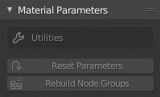
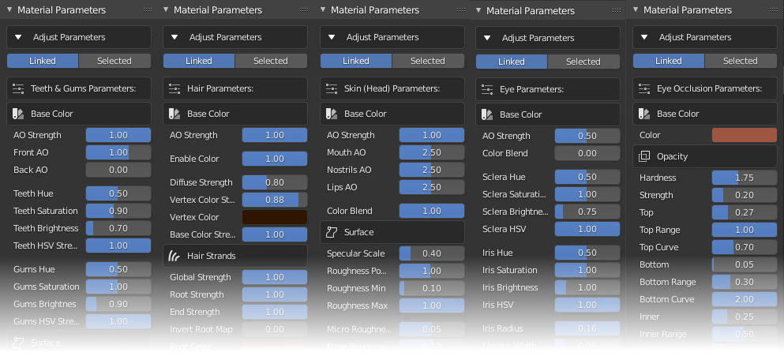
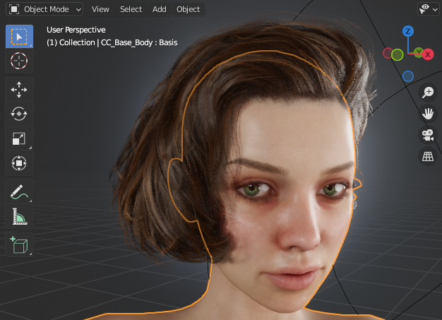
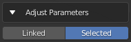
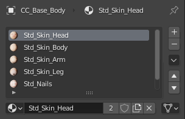
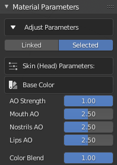
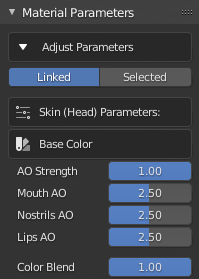

#####################
 Material Parameters
#####################

    *Default material pane*

Opening the **Material Parameters** dropdown will show the default material parameters pane, which will be initially devoid of any information.

Once a character has been imported, the material parameters pane will show a context sensitive set of parameters dependent on the object selected in the viewport. 

    *Illustration of various material parameter sets*

The 5 principal object types (relating to the character itself rather than any clothing or accessories) are the *Skin, Eyes, Eye Occlusion, Hair and Teeth*.

.. admonition:: Notable Parameters

    When manipulating the material parameters the function of most parameters is self evident, however there are several which require further explanation.

    * *Color Blending* - When a map such as a *micro normal map* or an *ambient occlusion map* is being blended with a base normal map or diffuse texture, the shader requires a parameter to control the extent of the blending.  These parameters are labelled as a *strength* for *multiplicative* type blending, and as a *blend overlay strength* for *overlay* type blending.  These parameters are discussed :ref:`here<Notes on Color Mixing>`.

    * *Exponents* - There are many occasions where exponents are used with an input map (e.g. Roughness) in order to change the map values in a non linear way.  For example to exaggerate roughness in relatively smooth areas or to de-emphasize roughness in rougher areas.  Please see :ref:`these notes<Notes on Power Functions>` on the effects of exponents.

    * *Min-Max* - Occasionally, a min and max value is used to define upper and lower limits for value ranges of input bitmaps.  These are not simple value clamps, instead they are a remapping of the input values to a new user defined range.  This is explained more thoroughly :ref:`here<Notes on Remapping Functions>`.

|

*****************************
Examining Material Parameters
*****************************

Single Materials
================

In order to view the settings specific to a particular object's material, you must first select the object in Blender's viewport (in *Object Mode*).

.. |mtpr| image:: /images/material_properties.png

|

To examine or manipulate a single material first make sure that in *Adjust Parameters* the *Selected* button is active.

|

Click on the *Material Properties* tab |mtpr| in the *properties* pane.  Then select the material you require from the displayed materials list.

The *Material Parameters* pane of the CC/iC Pipeline tool will then be updated with the available settings for the *Selected Material*.

|

..
    .. tip::

        As of add-on version 1.4.3, the material parameters that are not considered during export back to Character Creator during the :ref:`Blender Round Trip` are labelled in **red**. This coloration has no effect other than to highlight which parameters will be ignored during export back to CC.

Linked Materials
================

Many of the materials in the imported character share the same shader, this allows for the collective editing of shared shader parameters across multiple materials; referred to here as *Linked Materials*.

.. 
    from params.py
    LINKED_MATERIALS = [
    ["SKIN_HEAD", "SKIN_BODY", "SKIN_ARM", "SKIN_LEG"],
    ["EYE_RIGHT", "CORNEA_RIGHT", "EYE_LEFT", "CORNEA_LEFT"],
    ["OCCLUSION_RIGHT", "OCCLUSION_LEFT"],
    ["TEARLINE_RIGHT", "TEARLINE_LEFT"],
    ["TEETH_UPPER", "TEETH_LOWER"],
    ["HAIR"],
    ["SCALP"],
    ]

*Linked Materials* are grouped as follows

* :ref:`Skin (Head), Skin (Body), Skin (Arm) & Skin (leg)<Skin Materials>`
* :ref:`Eye (Right + Left) & Eye (Right Cornea + left Cornea)<Eyeball>`
* :ref:`Eye Occlusion (Left + Right)<Eye Occlusion>`
* :ref:`Tearline (Left + Right)<TearLine>`
* :ref:`Teeth & Gums (Upper + Lower)<Teeth, Gums and Tongue>`
* :ref:`Hair (All types present)<Material Parameters>`
* :ref:`Scalp<Skin Parameters>`

In order to edit the settings for a group of linked materials ensure that in *Adjust Parameters* the *Linked* button is active.

|

Selecting an object in in Blender's viewport (in *Object Mode*) will then update the *Material Parameters* pane of the CC/iC Pipeline tool with the available settings for the *Linked Materials* associated with the selected object.

Thus, multiple settings can be simultaneously edited and consistency maintained across the linked materials in an imported character.

|

*****************************
Material Parameter Discussion
*****************************

The specific parameters for each material type are discussed in details in the following sections:

* :ref:`Eyes<eyes>` A full discussion of the eye structure and the options (including alternative materials) available.
* :ref:`Skin<skin parameters>` All of the skin shader parameters and their location specific properties are discussed.
* :ref:`Teeth, Gums and Tongue<Teeth, Gums and Tongue>` A discussion of the shaders used inside the mouth.
* :ref:`Hair <Material Parameters>` TBD

