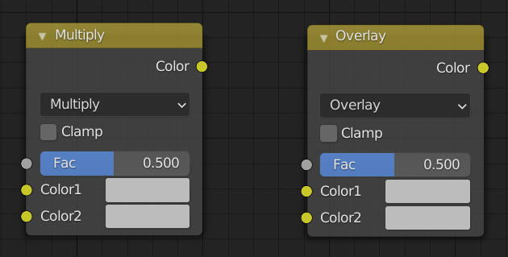

.. |br| raw:: html

    

~~~~~~~~~~~~~~~~~~~~~~~
 Notes on Color Mixing
~~~~~~~~~~~~~~~~~~~~~~~

There are two principal modes of color blending used by this tool's shaders *Multiply* and *Overlay*. These are used in a MixRGB type shadernode (*Color -> MixRGB* in the add node menu).

    *Multiply and Overlay MixRGB nodes*

The node has 3 inputs: two of which are color data from the two bitmaps that are being blended (i.e. the **base map** and the **blend map**); the other is the blending *factor*.  The *factor* is the value exposed in the shader which controls the desired extent of blending (more later).

Multiply Blending
-----------------

Multiply blending takes a values from the **base map** :math:`a` and multiples them with values from the **blend map** :math:`b`. 

.. math::
    f(a,b) = a.b

The usual effect of this is to darken the image.

Overlay Blending
----------------

Overlay blending effectively combines multiply blending with it's opposite (screen blending - which will usually lighten an image) Thus we combine:

    **Multiply:** :math:`f(a,b) = a.b`

with

    **Screen:** :math:`f(a,b) = 1 - (1 - a).(1 - b)`

to give:

    **Overlay:**

    :math:`f(a,b) = 2ab`  **( if** :math:`a < 0.5` **)**

    :math:`f(a,b) = 1 - 2(1 - a).(1 -b )`  **( if** :math:`a > 0.5` **)** 

This will give a S-curve type response, where light areas are lightened and dark areas are darkened, with small or no change to the mid brightness areas.

Blending Factor
---------------

The blending *factor* is a *linear interpolation* parameter (between 0 and 1) which describes the extent of blending between the original **base map** and the fully *multiply* or *overlay blended* (see above) map.

The example below is the real example of a  **base** normal map being overlay blended with a micro-normal **blend** map.

.. |ov00| image:: /images/overlay_0.0.png
    :width: 210    

.. |ov00_t| replace:: 
    *Blending Factor* = **0**

.. |ov05| image:: /images/overlay_0.5.png
    :width: 210

.. |ov05_t| replace:: 
    *Blending Factor* = **0.5**

.. |ov10| image:: /images/overlay_1.0.png
    :width: 210

.. |ov10_t| replace:: 
    *Blending Factor* = **1**

.. list-table::
   :widths: 1 1 1
   :header-rows: 0

   * - |ov00|
     - |ov05|
     - |ov10|
   * - |ov00_t|
     - |ov05_t|
     - |ov10_t|   

The full extent of the blending can be finely controlled using exposed shader parameters (in this example the *Normal Blend Strength* in the *Skin (Head)* material).

 