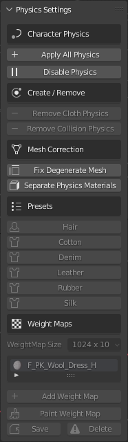
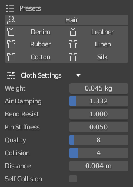
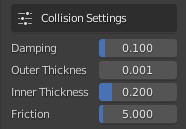
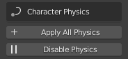
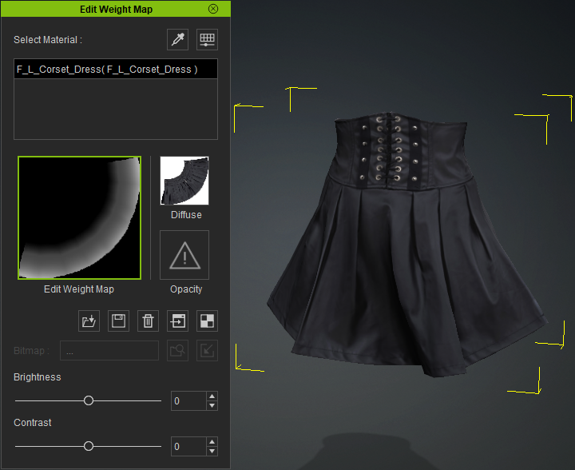
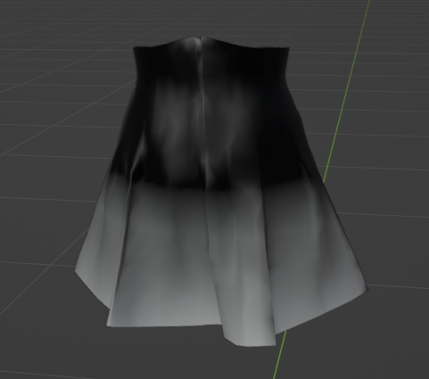
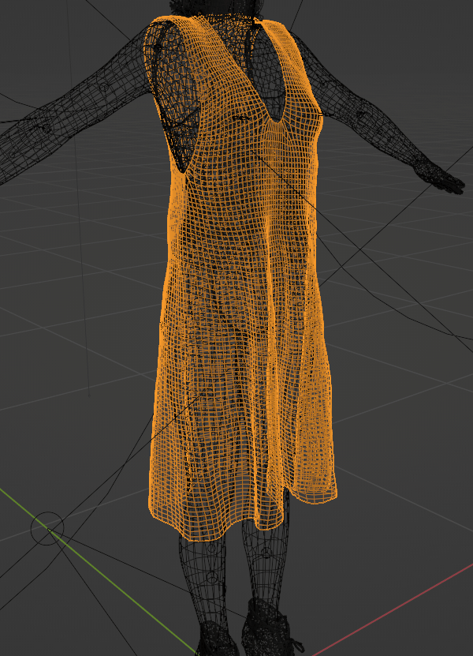
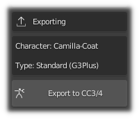
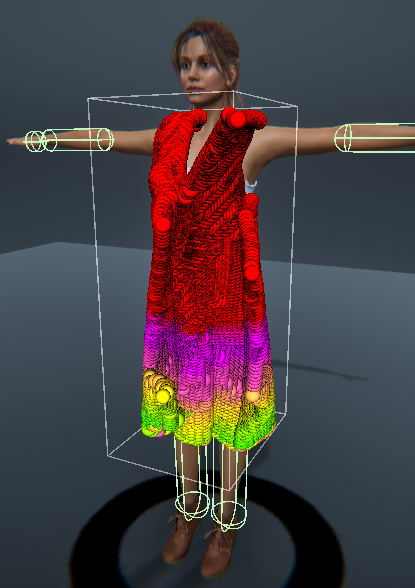
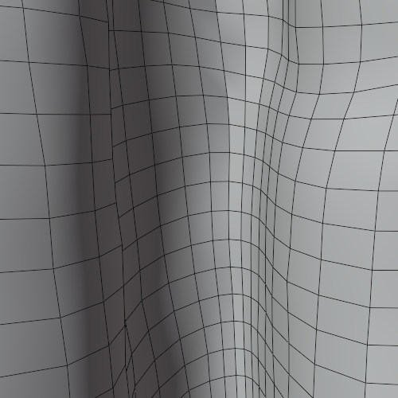

.. |br2| raw:: html

     

.. |br| raw:: html

    

.. _BSDF: https://docs.blender.org/manual/en/latest/render/shader_nodes/shader/principled.html

.. _append: https://docs.blender.org/manual/en/latest/files/linked_libraries/link_append.html

.. _Cloth Physics: https://docs.blender.org/manual/en/latest/physics/cloth/index.html

.. _Collision Physics: https://docs.blender.org/manual/en/latest/physics/collision.html

.. _Blender Physics documentation: https://docs.blender.org/manual/en/latest/physics/index.html

.. _Blender Texture Painting: https://docs.blender.org/manual/en/latest/sculpt_paint/texture_paint/index.html

.. _Unity Cloth Physics documentation: https://soupday.github.io/cc_unity_tools/physics.html#cloth-physics

.. _Clean Up: https://docs.blender.org/manual/en/latest/modeling/meshes/editing/mesh/cleanup.html

.. _Sculpt Tools: https://docs.blender.org/manual/en/latest/sculpt_paint/sculpting/editing/sculpt.html

.. _Preview Range: https://docs.blender.org/manual/en/latest/editors/graph_editor/introduction.html#graph-preview-range

.. _Local View: https://docs.blender.org/manual/en/latest/editors/3dview/navigate/local_view.html

~~~~~~~~~
 Physics
~~~~~~~~~

Adding and Editing Physics
~~~~~~~~~~~~~~~~~~~~~~~~~~

Importing with Physics
======================

When the *Physics* option is selected in the **Import/Export** panel then when the character is imported, *cloth physics*, *vertex groups* and *modifiers* will be automatically generated for any of the mesh objects & materials that have PhysX weight maps. All of which can be changed at will should you need to.

Thus, to import a character with physics enabled (highlighted blue), in the **Import/Export** panel follow the procedure for :ref:`Standard Import` (do not use the standard fbx importer for this).

.. admonition:: Important Consideration For Cloth Simulation

  Always allow Blender to compute the full range of frames for any cloth simulation by playing the whole animation through with no :ref:`frame dropping`.
  
  This will be initially slow; however this **must** be done in order to cache the cloth calculations.

  Once this is done you may then spool through the animation or enable :ref:`frame dropping` to get closer to real time playback (as much as Blender allows before requiring a re-calculation).
  
  Failure to do this will cause the cloth simulation to break and behave erratically.

Cloth Physics
=============

The **Cloth Physics** panel in the CC/iC Create Tab contains a comprehensive set of controls to adjust the physics parameters of the currently selected object.

**Character Physics** - Apply/Disable all physics.  This will (re)apply or disable all of the physics settings contained in the CC/iC character export (along with any manually added physics settings). This applies to **Cloth Physics**, **Hair Physics** or both.

**Cloth Simulation** - This section will change depending on the *currently selected object* in 'Object Mode'. When an object has no active physics, then an option to 'Add Cloth Physics' is available.

If the object had physics enabled already, then the **Cloth Simulation Controls** are shown (detailed below).

**Cloth Collision** - This controls wether or not the *currently selected object* will act as a collider for cloth physics.  When an object is not set as a a cloth collider, it will be ignored by the cloth simulation.

The **Use Proxy** option allows the creation of a proxy collider which can be decimated (*via* the decimate value slider) in order to simplify the calculations required by the simulation.  The use of a proxy collider potentially of great utility and is discussed in the :ref:`Cloth Collision` section below. 

**Mesh Correction** - Settings to help improve cloth simulation.

- Fix Degenerate Mesh: This will remove degenerate mesh elements from the mesh - this include loose vertices, orphaned edges, zero length edges etc.  The presence of these elements may cause problems with simulation.

- Separate Physics Materials: This will separate the object by material and apply physics to the separated objects that have weight maps.  This may increase performance where only a small part of an object is simulated.

|br2|

Cloth Simulation Controls
-------------------------

These controls are the settings ONLY for the *currently selected object* (i.e. each physics enabled object has its own unique settings).

|br|
- **Presets** - This will impose physics settings on the object that approximate the behavior of the named material (Cotton, Silk etc).  *These values are tuned to deliver similar responses for cloth hair and dynamic spring bone behavior*.

|br|
- **Cloth Settings** are a convenient access point to the standard Blender cloth physics settings (by default seen in the *Physics Properties* of the standard *Properties* pane). These are only shown when an object (e.g. a clothing item) has had 'Cloth Physics' applied to it and is selected. 

|br|

Cloth Collision
---------------

Any object can be made into a cloth collision object. After activating an object as a cloth collider, a 'Collision Settings' foldout will immediately become available: 

**Collision Settings** are the standard blender collision settings (by default seen in the *Physics Properties* of the standard *Properties* pane).  These are only shown when an object has had 'Collision Physics' applied to it and is selected.  This is mostly applicable to the character's body since Blender uses the character mesh as a collider for physics simulation.

An object which has a cloth simulation on it can also act as a cloth collider. This may produce undesirable results when various cloth objects conflict with each other.  Such conflict can be avoided by baking the cloth simulations in layers - as outlined in the :ref:`Cloth Physics Cache - (Blender Point Cache)` section.

Proxy Cloth Collision
---------------------

If an object is not simulated (it has no physics and is only animated by skeletal movements) then instead of using the actual (visible) object, a (invisible) proxy object can be created which acts as a cloth collider.

.. Tip::
  A proxy collider can be used in cases where there is some visible mesh penetration of the simulated cloth by the character's body.

  - If the actual body mesh is being used as a collider then any editing of that mesh in order to 'fix' any mesh penetration will change the shape of the collider itself and have an effect on the simulation.

  - If a proxy collision object has been created, then any subsequent editing of the body mesh (for example deleting any faces that penetrate the cloth mesh) will have no effect on the proxy collider and will not change the simulation.

  Thus a proxy collider lets you use the full volume of the characters body as a cloth collider, without the need to have visible mesh in the parts covered by clothing.  This is similar to the 'Delete hidden Faces' functions of Character Creator - but it retains the effective volume of the full original mesh shape.

.. Note:: 
  It is important that to properly use a character body as a proxy collider that you must export the full mesh from Character Creator: you cannot use 'Delete Hidden Faces' if you intend to use a proxy collider for the character body.
  

If an object is suitable for being made into a proxy, then the 'Use Proxy' toogle will be available in the 'Cloth Collision' pane.

  .. image:: images/bl-cloth-col-proxy-toggle.png

The decimate value is the factor by which the proxy is simplified (using a standard Blender decimate modifier).

Once the 'Add Cloth Collision' button is pressed (with 'Use Proxy' toggled ON) then a proxy collider is created and decimated by the value in the decimate field and a 'Show Collision Proxy' toggle will be available.

  .. image:: images/bl-cloth-col-proxy-show.png

The 'Show Collision Proxy' toggle will allow you to view the proxy collision object in isolation (it actually shows the object in Blender's `Local View`_)

You may then freely edit the original object (again Local View is helpful here) in order to meet your needs.

Cloth Physics Cache - (Blender Point Cache)
-------------------------------------------

**Animation Range** - The range of the animation can be quickly manipulated here. Two distinct frame range functions are available:

- **Use Preview Range** |prev| - This will activate the *Viewport Preview Range*. This can be set in the timeline window, for more details see the `Preview Range`_ section of the official Blender documentation.

- **Expand Animation Range** |exp| - This tool is used to increase the scene animation frame range to the frame range of the current action on the character (it will never decrease the frame range).

- **Fit Animation Range** |fit| - This tool will always match the scene frame range to the frame range of the current action on the character.

**'Cloth Simulation' (cache)** - Allows quick access to the physics baking functions for the object's Cloth Physics.

- **Reset** |reset|

   Resets the physics point cache on the currently selected object and synchronizes the physics point cache ranges on the current object to fit the current scene animation range. i.e. If the point cache frame range does not cover the current scene range (or preview range) it will be extended to fit.

- **Bake** |bake|
  
   This will bake the physics simulation to Blender's point cache for the currently **selected** cloth object.

- **Free** |free|

   This will clear the point cache for the selected object.

.. Admonition::
   The baking system can be used to properly simulate layers of clothing. 
   
   This example uses the Cloth Physics Tools in the CC/iC Create tab: If you are using several layers of clothing the following procedure will be of use.

   1. Select the innermost layer of clothing (e.g. a skirt or a dress) and **Add Cloth Physics** to it (with the button of the same name).

   2. Select the character's body and **Add Cloth Collision** to it (named button).  This will allow the simulated cloth to collide with the character body.

   3. Select the innermost clothing object and '**Bake the Simulation**'.

   4. Now we can simulate the next layer of clothing.  Select the object of the next layer of clothing (e.g. a long coat or shawl) and **Add Cloth Physics** to it.

   5. **We can now use the baked simulation of the innermost layer as a collision object**.  Thus we can **Add Cloth Collision** to the innermost object (used in step 1.).  This will allow the simulation of the outer object to collide properly with the inner object without making a terrible mess of the inner object's simulation (since it is now baked in).

   6. Select the outer clothing object and '**Bake the Simulation**'.

   7. The outer object can be used as a collision object for the hair simulation.  Again, this is done with the **Add Cloth Collision** button for the outer object.

   8. Finally, the Spring Bone Hair simulation can now be baked (in the CC/iC Pipeline Tab - Scene Tools)

   This builds up layers of simulation that aren't allowed to interfere with each other (since that often causes huge problems with Blender physics simulation). Below is an example render of this multi layered baking approach.

      .. youtube:: 7Nr_LADT3yE
   

If you wish to manipulate ALL of the physics caches simultaneously then tools to do that are available in the Scene Tools section of the CC/iC create tab; see the :ref:`Simulation Baking (Point Cache)` documentation for further details.

..
   **Cloth Settings** and **Collision Settings** are the standard physics settings used by Blender in the *Physics Properties* of the standard *Properties* pane (only presented here for user convenience -  only visible when cloth or collision physics have been applied to the object and that object is selected).

The example below shows a standard 'Silk' preset applied to a dress object during an animation (mesh highlighted for clarity).

.. figure:: images/dress_physics.gif
  :align: center

  *Standard Silk Simulation*

.. admonition:: Hair Physics

  Whilst early versions of hair from Character Creator have properly defined physics properties, certain newer ones may not simulate correctly.  Smart Hair should now simulate correctly (as of version 1.3.6).

|

Workflow: Adding Object Physics
===============================

This workflow discussion is specifically aimed at adding physics properties that are suitable for return to Character Creator or for further use in Unity.  For the purpose of **only** adding physics for use in **Blender** then please consult the official `Blender Physics documentation`_ for details.

**Export According To Pipeline**

As with the :ref:`Adding Objects to Characters` workflow, it is imperative that the character you wish to work with is exported from Character Creator with the appropriate settings for the pipeline being used.

+ If you wish to add a physics enabled item and then return the character to Character Creator, the please export from CC using the :ref:`Blender Round Trip Workflow`.

+ If you intend solely to use the character and physics enabled item in Blender, then use the basic :ref:`Export Settings From Character Creator or iClone`.

+ If you wish to have a character that is editable (and indeed re-editable) in Blender which will ultimately be destined for Unity, then follow the directions in the :ref:`Unity Round Trip Workflow`.

**Import Character**

The correctly exported character should be imported into Blender with a :ref:`standard import` (physics will be deliberately added in a later step).

The item to which physics is to be added can either be part of the export from Character Creator or can be created directly or appended from a library file (if you are adding a new item then please follow the instructions in :ref:`Adding Objects to Characters` to correctly incorporate it).

+ Open the *CC/iC Create* tab.

+ In the 'Character Physics' section, click on 'Apply All Physics'. This will enable physics on all the applicable items (colliders for the character body, and cloth for any items that have physics enabled in Character Creator).

  | |physChar|

.. |createRemove| image:: images/b-phys-create.png

+ In *Object Mode* select the item to have physics added to it; in the 'Create/Remove' section click on 'Add Cloth Physics'.  This will enable cloth physics for the selected item and add a modifier which uses a *weight map* texture to control allowed cloth deformation.  Presets for several cloth types are also made available which will control the response of the cloth to cloth simulation.

  | |createRemove|

After Cloth Physics is added, a suitable weight map must be painted onto the object which will control how much the object is permitted to be deformed by cloth physics simulation.

Workflow: Physics Weight Mapping
================================

Cloth simulation in Character Creator/iClone is controlled not only by the cloth parameters, but also by a monochrome texture or "weight map" which is used to determine the extent to which the cloth is permitted to be moved by the physics simulation (this weight map like all textures uses the model's UV coordinates).

  *Character Creator Item With Physics Weight Map*

This Blender add-on allows this weight map to be painted directly onto the item model using Blender's own texture painting tools allowing fine control.

  *Blender Physics Weight Map Painted on Above Item*

.. Note:: 

  The weight map is monochrome (*black* and *white*) and as such uses *black* to mean that part of the model will not move and *white* to mean that part of the model can move freely.  The grey scale in-between will permit an increasing amount of movement. 

.. image:: images/b-phys-weight.png
  :align: left

To begin weight map painting, in the 'Weight Maps' section click on 'Paint weight Map'.  This will change Blender into *Texture Paint* mode, whereupon the Blender texture paint tools may be used (see the documentation on `Blender Texture Painting`_ for further details).

Should you require a different size of weight map (larger or smaller) then (prior to starting the painting) select the desired size of map from the dropdown list and then click 'Resize Weightmap'. 

.. |gradPaint| image:: images/b-gradient-pick.png

.. tip:: 

  You can use the *Gradient Fill Mode* to easily paint a smooth predictable gradient onto the model.

  When weight painting select the *Fill Tool* on the Left hand side tool strip. |fillTool|

  Then in the Right hand tool bar select the *Tool* tab and in the *Color Picker* switch from *Color* to *Gradient*
  
  |gradPaint|
  
  Set up the gradient as you see fit. Then on the model position the pointer where you wish the gradient to begin, press **CTRL** then press **LMB** move the pointer to wherever you wish the gradient to end (a solid line will be shown) and release the LMB to impose the gradient along the line.
  
Once weight painting is complete, then click on 'Done Weight Painting'

If you are satisfied with the weight painting then click 'Save' to store the weight map.

.. warning:: 
  Weight painting physics requires some *subtlety*, where too much freedom will result in a disastrous simulation in Character Creator and too little will not allow anything visible to happen.

  Several attempts will probably be needed before the results are acceptable.

The images below are the actual results of a weight painting.  The weight painted model (left) only has a small area able to move freely, this is reflected in the Blender cloth simulation (center).  **NB**: The Blender simulation is somewhat different to Character Creator's and as such should only be used a a guide (grey areas are far more restricted in Blender).  Finally the Character Creator result (right) shows a visible range of motion in accordance with the grey-white painted areas of the weight map.

.. |wp_tex| image:: images/b-weightpaint-grad.png

.. |wp_cc| image:: images/cc_simulation_lo.gif

.. list-table::
   :widths: 2 2 2
   :header-rows: 0

   * - |wp_tex|
     - |wp_blender|
     - |wp_cc|
   * - Weight painted model in Blender
     - Wind simulation in Blender
     - Idle movement simulation in Character Creator 

Workflow: Exporting According to Pipeline
=========================================

**Return to Character Creator:** To return the character to Character Creator follow the procedure described in the Round Trip :ref:`Detailed Workflow` section of the documentation: using the 'Export to CC3/4' function (Either in the Import/Export section of the *CC/iC Pipeline* Tab or the Quick Export section of the *CC/iC Create* Tab).

| 

This export can be re-imported using the 'Plugins -> Blender Pipeline -> Import Character From Blender'.  The physics will be automatically activated on the newly enabled working object and the physics weight map will be automatically applied along with any parameter settings made in Blender.

.. figure:: images/blender-cc4-phys-weightmaped.png
    :align: center
    :width: 400

    *Newly Physics Enabled Item Returned to Character Creator*

This item is now ready for use.

**Export to Unity:** In the case of further export to Unity, again the positioning and weight painting mean that it can be safely exported to Unity as described in the :ref:`Unity Round Trip Workflow`.

.. tip::
  It is of immense benefit to **export the model to Unity as a Blend file** and to **export the model directly into the Unity project** (in a folder under /Assets in the Unity project folder structure).

  This allows rapid editing of the physics data (and indeed any other aspect of the model):
  
   - **Double-click on the blend file from within the Unity project** to begin editing.
   
   - Return to Unity with the **'Update Unity Project'** function (see :ref:`Unity Round Trip Workflow`).  
   
   - **Rebuild the cloth physics** with the Unity addon.

Once processed in Unity with the 'Cloth Physics' feature enabled (see the `Unity Cloth Physics documentation`_) then the physics item will be appropriately constraint painted and have the correct colliders associated with it.

    *Unity Constraint Painted In Line With The Blender Weight Map*

Actions to Aid Cloth Simulation
===============================

Sometimes, cloth simulations do not behave as expected. This can be for a number of reasons which include:

- Improper cloth parameters.

- Improper weight Mapping.

- Mesh errors.

- Mesh distortion.

The cloth parameters and weight mapping have been discussed above and are principally responsible for how the cloth performs (too much/too little freedom and flexibility etc.) which can be adjusted easily to your needs.

Mesh problems can however cause cloth simulation to fail spectacularly.

- Mesh degeneracy will often cause simulations to fail - examples of this include:
  
  + Zero length edges

  + Zero area faces

  + Orphaned/duplicated vertices

  Blender has internal tools to help with these problems (see Blender's `Clean Up`_ documentation).

  A simple tool has also been provided to rapidly remove most offending items - in the '*Mesh Correction*' section of the physics foldout, use the '*Fix Degenerate Mesh*' tool to correct the above problems.

  | |fixDeg|

- Mesh distortion, e.g. meshes that have been folded over themselves can also cause significant problems.

  These can be readily corrected by use of the '*Smooth*' tool in '*Sculpt mode*'.
  
  **Please note:** the smooth tool should be used at very low *strength* (0.075 - 0.100) to avoid doing damage to the mesh.

  | |smth| *Smooth Tool* 

.. |preSmooth| image:: images/b-pre-smh.png

.. list-table::
   :widths: 2 2
   :header-rows: 0

   * - |preSmooth|
     - |postSmooth|
   * - Folded, distorted mesh which will cause cloth simulation problems.
     - Smoothed mesh to remove folded elements will allow better cloth simulation. 

For more details please see Blender's `Sculpt Tools`_ documentation.

