.. |br2| raw:: html

     

.. |br| raw:: html

    

.. _Github repository: https://github.com/soupday/CC4-Blender-Tools-Plugin

.. _latest release: https://github.com/soupday/CC4-Blender-Tools-Plugin/releases

.. _Cc/iC Blender Tools: https://github.com/soupday/cc_blender_tools

.. _3D: https://github.com/soupday/cc_unity_tools_3D

.. _URP: https://github.com/soupday/cc_unity_tools_URP

.. _HDRP: https://github.com/soupday/cc_unity_tools_HDRP

.. _CC/iC Unity Tools documentation: https://soupday.github.io/cc_unity_tools/

.. _CC/iC Unity Tools: https://soupday.github.io/cc_unity_tools/

.. _drag that into the unity project: https://soupday.github.io/cc_unity_tools/usage.html#importing-into-unity

.. _Importing into Unity: https://soupday.github.io/cc_unity_tools/usage.html#importing-into-unity

.. _build the materials: https://soupday.github.io/cc_unity_tools/usage.html#beginning-the-import

.. _CC/iC Unity Tools Usage: https://soupday.github.io/cc_unity_tools/usage.html#usage

.. _iClone Animation Pipeline: https://www.reallusion.com/iclone/pipeline.html

.. _Importing models into Unity: https://docs.unity3d.com/Manual/models-importing.html

~~~~~~~~~~~~~~~~~~~~~~~~~~~~~~~
 CC - Blender - Unity Pipeline
~~~~~~~~~~~~~~~~~~~~~~~~~~~~~~~

The 'Character Creator (CC) - Blender - Unity Pipeline' is an eco-system where character data can be exchanged (in both directions) between CC & Blender and Blender & Unity.  

Blender Round Trip
~~~~~~~~~~~~~~~~~~

As discussed in the :ref:`Morph Editing` section, it is possible to export from Character Creator to Blender with an Fbx Key which permits the reimport of the model back into Character Creator.  The import/export process for this has been simplified with a Character Creator plugin for this purpose:

CC4 Blender Tools Plugin
========================

The CC4 Blender Tools Plugin is available from the linked `Github repository`_, an installer can be downloaded from the `latest release`_ page. 

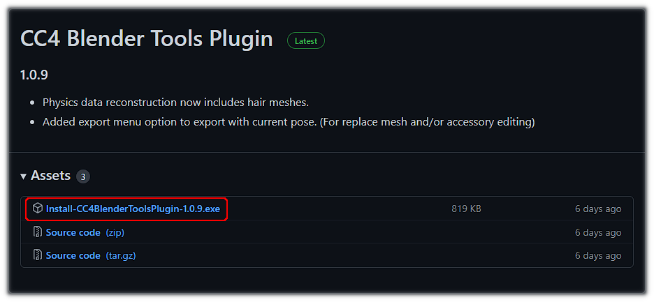
    
    *Latest release download page*

Plugin Installation
-------------------

- Download and run the installer from the `latest release`_ page.  

- If you are using Windows Defender, then because this installer executable is uncommonly encountered it may show a "Windows Protected your PC" warning message about using the file:

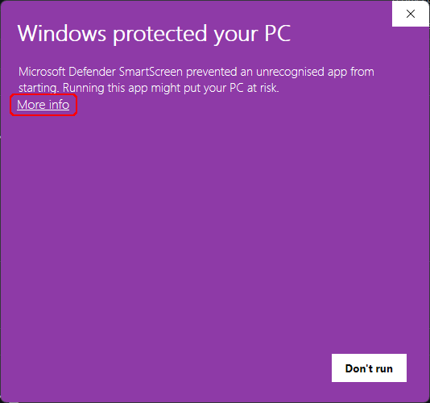

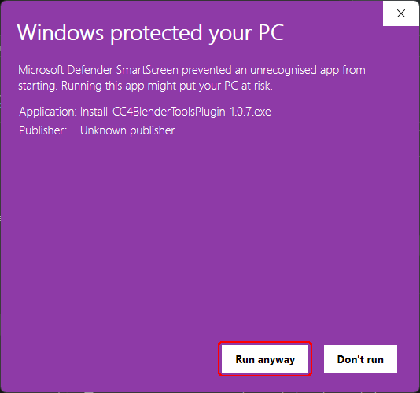

- |def_warn| |def_run|

- This can be overridden by clicking on 'More Info' and then 'Run Anyway'.  

- The installer will place a folder called 'CC4 Blender Tools' in the 'Character Creator 4/Bin64/OpenPlugin' directory of your CC4 installation.

.. code-block::

  <Installation Folder>
    |-- Character Creator 4
    |     |-- Bin 64
    |           |-- OpenPlugin
    |               |-- CC4-Blender Tools
    |-- Common
    |-- Ico
    |-- Image ... (etc)

- The plugin will be auto detected the next time you start Character Creator and needs no further intervention. A new 'Blender Pipeline' entry will be added to the 'Plugins' menu.

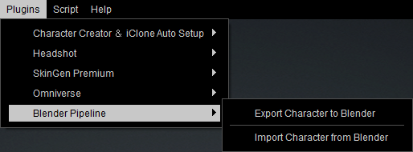

    *New menu entry after successful installation*

Manual Plugin Installation
--------------------------

If you do not wish to run an executable on your system, then as an alternative to downloading the installer, you can download the 'Source code (zip)'.

- Download 'Source code (zip)' from the `latest release`_ page.  

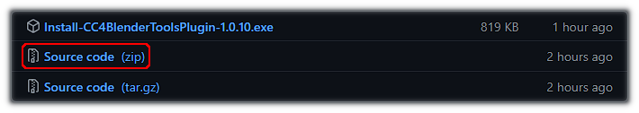
    
    *Latest release source package*

Once downloaded:

- Navigate to '<Installation Folder>/Character Creator 4/Bin64/OpenPlugin'

- Delete any previous versions of 'CC4-Blender Tools'

- Open the zip file and drag the CC4-Blender-Tools-Plugin folder into the OpenPlugin Folder

- The folder structure will look something like this:

.. code-block::

  <Installation Folder>
    |-- Character Creator 4
    |     |-- Bin 64
    |           |-- OpenPlugin
    |               |-- CC4-Blender-Tools-Plugin-1.0.10

- If the plugin is correctly installed then it will be recognized the next time Character Creator is started and will add a new 'Blender Pipeline' entry in the 'Plugins' menu.

    *New menu entry after successful installation*

Plugin Removal
--------------

Navigate to the 'Character Creator 4/Bin64/OpenPlugin' directory and delete the 'CC4 Blender Tools' directory.

.. admonition::
    Path Length Information.

    Earlier versions of the plugin (v1.0.9 and earlier) had a path length limit (MAX_PATH) which obeys the Windows API limit of 260 chars.  Where path lengths are longer than 260 characters, the re-import of some textures can fail silently and leave the model incompletely textured.

    This has been fixed in v 1.0.10 and above - *please update the plugin if you are using an earlier version*.

Blender Round Trip Workflow
===========================

The basic 'round trip' workflow is as follows:  Setup a character in Character Creator; use the plugin to export it to Blender; import and manipulate the character in Blender (e.g. sculpt); export the Character back into CC4 to update CC4 with the changes made in Blender.  

Detailed Workflow
-----------------

.. _this video: https://www.youtube.com/watch?v=XFQOrgVcqcw

- Prepare a character in Character Creator

    .. image:: images/cc4-blender-pipeline-source.png
        :align: center
        :width: 250

- Open the Blender Pipeline Export Tool (*Plugins -> Blender Pipeline -> Export Character to Blender*).

    .. image:: images/cc4-blender-pipeline-tool.png
        :align: center
        

- Export Character either as A-Posed Character (*Mesh Only* option) or In the current character pose (*Current Pose* option). Depending on your requirements (select via the buttons on the top row - the relevant settings will be auto-filled).

    + **Mesh Only: Round Trip Editing -** Export the character as mesh only in the bind pose without animation, with full facial expression data and human IK profile (non-standard),for complete round trip character editing.

    + **Current Pose: Accessory Creation / Replace Mesh -** Export the full character in the current pose, for accessory creation or replacement mesh editing.

..
 .. image:: images/cc4-plugin-menu.png
    :align: center
    :width: 350

- Begin the export by clicking the 'Export Character' button.
    
- This will immediately prompt for a save location and requires no further settings to be made.  Save to the location of your choice: This will export the character along with a *.fbxkey* file which allows for reimport into Character Creator.

- In Blender, perform a :ref:`Standard Import` of the exported character.

- Please Note: When imported into Blender and clothing items that have had their faces hidden by Character Creator will now have those faces revealed (i.e. you will see the whole meshes) and there may appear to be clip through/mesh penetration (you can hide those faces again once the character returns to Character Creator).

 .. image:: images/cc4-blender-pipeline-import.png
    :align: center
    :width: 250

- Using Blender, manipulate the character however you see fit (you may not alter the composition of any existing meshes - i.e. you cannot add or remove vertices):  

    Sculpt/Alter Mesh Topology* |br|
    Edit Textures* |br|
    Add extra accessory items and use Blender's shader nodes to shade them |br| 
    Paint physics weight maps for new or existing items |br|

    \*Example sculpting and texture editing demonstrated in `this video`_

- Material parameters may also be adjusted.  Most of these parameters are eligible to be returned to Character Creator, however some are Blender specific and will not be considered when exporting back to CC.  The parameters that cannot be returned to CC are highlighted in **red** (this highlight is only shown when the imported character has a valid fbx key and is suitable for the 'Round Trip').

 .. image:: images/cc4-blender-pipeline-material-panel.png
    :align: center

- Once finished, the character can be exported back to Character Created by using the 'Export to CC3/4' button in the 'Exporting' section of the Blender Tool (NB this till only be available if the original model was correctly exported with a fbx key).

 .. image:: images/cc4-blender-pipeline-export-panel.png
    :align: center

- This will prompt for a save location and will default to a file name of '<*original name*>_export.fbx'. Since the returning model references all the textures as relative paths and reuses the original exported textures (and any new/edited textures assigned to image nodes will be added to the export .json with their relative paths), then *it is safe to use the original export directory* as the save location.

- Once exported, the CC plugin can be used to re-import the model into Character Creator: using the menu option 'Plugins -> Blender Pipeline -> Import Character From Blender'.  This will bring up a file dialog.

- Navigate to the file exported from Blender (default name '<*original name*>_export.fbx') and click 'open'.

- An import options dialog box will be opened - leave 'Import Mesh', 'Import Textures' and 'Import Parameters' ticked and click 'Import Character'.

 .. image:: images/cc4-blender-pipeline-import-options.png
    :align: center
    :width: 250

- This will prompt to check the file path and fbx key path (these are auto filled) Click 'OK' to continue.

 .. image:: images/cc4-blender-pipeline-create-assets.png
    :align: center
    :width: 150

- After some initial processing a d status report will be shown, giving details of which meshes can be successfully re-imported.  Click 'OK' to continue.

 .. image:: images/cc4-blender-pipeline-import-status.png
    :align: center
    :width: 400

- After further texture processing the process will complete and the character will be manipulable in Character Creator.  Please note that any faces that are penetrating outer meshes must be manually re-hidden: please see :ref:`Hiding Meshes in CC4` for more details.

 .. image:: images/cc4-blender-pipeline-finish.png
    :align: center
    :width: 250

Hiding Meshes in CC4
--------------------

The CC4 documentation has details of a number of methods that can be used to hide 'penetrating meshes':

.. _Manually hiding specific inner meshes: https://manual.reallusion.com/Character-Creator-4/Content/ENU/4.0/08_Cloth/Hiding_Specific_Inner_Meshes.htm?Highlight=hide%20face

- `Manually hiding specific inner meshes`_ by hiding faces.

.. _Showing or Hiding Meshes: https://manual.reallusion.com/Character-Creator-4/Content/ENU/4.0/08_Creating_Custom_Assets/Showing_Hiding_Meshes_with_Brush.htm?Highlight=edit%20mesh

- `Showing or Hiding Meshes`_ using sculpting.

.. _Specifically hiding Body Mesh faces: https://manual.reallusion.com/Character-Creator-4/Content/ENU/4.0/08_Cloth/Hiding_Body_Meshes_by_Faces.htm?Highlight=hide%20face

- `Specifically hiding Body Mesh faces`_ with the 'Hide Body Mesh' tool.

|

Round Trip Export For Unity
~~~~~~~~~~~~~~~~~~~~~~~~~~~

.. Note::

    **Please Note:**  *This section deals only with the specific case of taking a character from Character Creator - Editing it in Blender - Then importing it into Unity whilst keeping physics and hidden face data intact for use in Unity.*

Export For Unity Introduction
=============================

The use of Blender as an intermediate between Character Creator and Unity enables the use of Blender's very powerful and varied tool set to directly assist with a Unity project.  It also allows the editing of the character in Blender after it has been imported into Unity - thus allowing changes to be made easily without having to go through all of the normal export/import steps again.

Unity Round Trip Workflow
=========================

This simplified workflow describes the *Export from CC to Blender; Manipulation in Blender; Export from Blender into a Unity Project; Further editing in Blender directly from the Unity Project.*

.. note::

    This workflow utilizes the :ref:`CC4 Blender Tools Plugin`, `Cc/iC Blender Tools`_ and the CC/iC Unity Tools for the render pipeline used by your project: either `3D`_, `URP`_ or `HDRP`_ (please see the `CC/iC Unity Tools documentation`_ for further details). 

- Prepare your character.

- Open the Blender Pipeline Export Tool (*Plugins -> Blender Pipeline -> Export Character to Blender*).

    .. image:: images/cc4-blender-pipeline-tool-unity.png
        :align: center

- Select the 'Blender > Unity' option from the top bar.

    + **Blender to Unity Pipeline:** Export the character with hidden faces removed, skin & hair textures baked and with T-pose bind pose, for editing in Blender before exporting from Blender to Unity.

- Begin the export by clicking the 'Export Character' button.

- This will immediately prompt for a save location and requires no further settings to be made. Save to the location of your choice: This will export the character along with a .fbxkey file which allows for reimport into Character Creator.

- Import the character into Blender with a :ref:`Standard Import` procedure.  This will bring the character into Blender in a T-Pose.

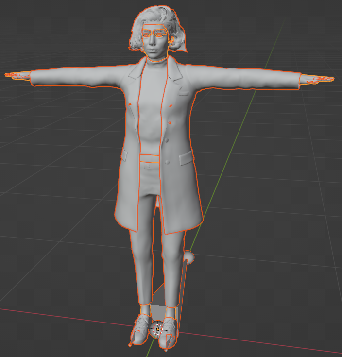

    *Imported Mesh Only in T-Pose (unshaded)*

- Since this is a simplified workflow let us assume some Blender manipulation takes place...

- The Export to Unity function (found in the 'Exporting' section of the Import/Export foldout) can output either a .FBX or a .Blend file

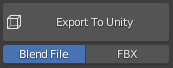

|

Exporting as a .Blend file
--------------------------

Whilst it is always possible to export to a directory somewhere in the filesystem, and then `drag that into the unity project`_, you may also **export directly into the Unity project**.  When using a .Blend file this offers some distinct advantages.

    + A link will be made with the export that changes the 'Export to Unity' function into  'Update Unity Project' 

    + .. figure:: images/update_unity.png
        

    + This allows any changes subsequently made to be transferred into the Unity project with a single click, rather than by doing another export.

    + If the character is re-opened from the Unity project (by double clicking on the .Blend file in the Project explorer window) then any edits made can also be transferred directly back to Unity using the 'Update Unity Project' button this is especially useful when fine tuning things like cloth physics weight maps.

Exporting as FBX
----------------

This is the universally used standard file format, however no quick access from unity is possible, so the character must be re-exported from blender and then re-imported into Unity if you wish to make subsequent changes.

*'Unity Round Trip Workflow' continues...*

- Import the character into Unity (only if it was exported to a folder outside of the unity project) by following the procedure here (`Importing into Unity`_)

- Follow the instructions in `Importing into Unity`_ to correctly import a character into Unity.

- Once the character is either imported for the first time or updated, then you will need to `build the materials`_ as usual to see any effects (mesh changes will be automatic - but its worth rebuilding the character anyway) 

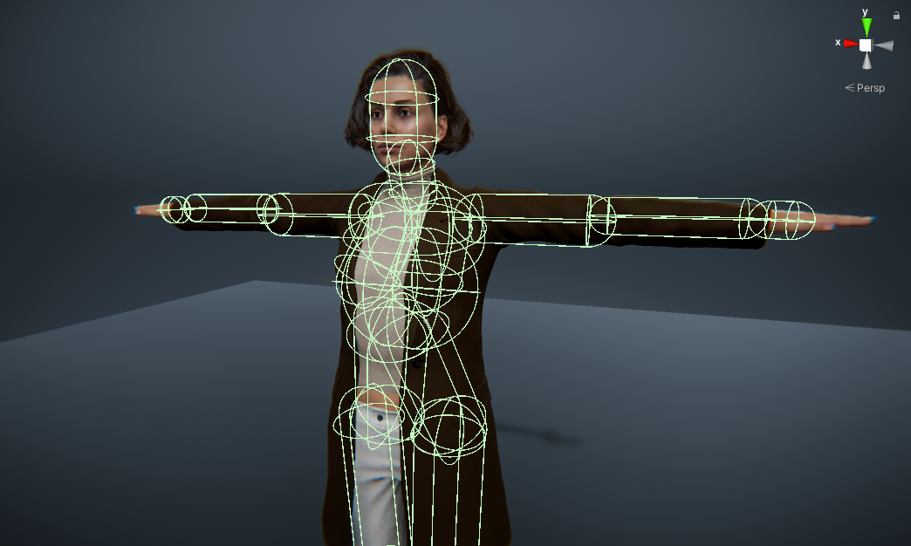

    *Imported into Unity in t-pose with correct physics colliders and hidden faces.*

Please see the `CC/iC Unity Tools Usage`_ documentation for a complete overview of the Unity import procedure.

Exporting after Rigify
----------------------

Once rigified *via* the :ref:`Rigify Creation Workflow` the option to export to a .Blend file is no longer available; furthermore it is no longer possible to return the character back to Character Creator.

The central purpose of rigifying the character is to create or edit animations (see the :ref:`Animation` and :ref:`Advanced Animation` sections for more detail), as such these animations should be used either in Blender itself or downstream in Unity.

To transfer any animations from Blender into iClone, then see the `iClone Animation Pipeline`_ webpage for an overview. 

- Rigfy the character (:ref:`Rigify Creation Workflow`), create, retarget or edit animations as needed.

- Depending on your requirements, export character as 'mesh only', 'motion only' or 'mesh and motion'.

    .. list-table::
        :widths: 2 5
        :header-rows: 0
        :align: center

        * - |mesh|
          - |mechtxt|
        * - |motion|
          - |motiontxt|
        * - |both|
          - |bothtxt|

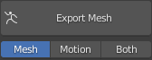

.. |mechtxt| replace::
    Export only the character mesh without any animation information.

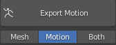

.. |motiontxt| replace::
    Export only the armature (skeleton) and any animation information in the **Current Timeline** (for that armature)

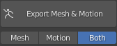

.. |bothtxt| replace::
    Export both the character model and any animation in the current timeline.

.. tip:: 
    
    **Using Motion Only in Unity:** Should you wish to use a *Motion Only* export in Unity, then some manual adjustment steps must be made before the animation can be properly used (only the *Mesh Only* and *Mesh & Motion* exports can be processed by using the `CC/iC Unity Tools`_ auto-setup).

    - Dragging the exported *Motion Only* .Fbx file into the Unity project.

    - Select it and click on the **'Rig'** selection button in the *Inspector Window* to show the Rig import details tab.

    .. figure:: images/rig-modelimporter-inspector.png
        :width: 400
        :align: center

        *Unity Model Import 'Rig' Inspector*
    
    - Change the *Animation Type* to **Humanoid** and click 'Apply'.

    - In Blender, the name of the action being exported will look similar to that shown below:

    .. figure:: images/blender-model-action-name.png
        :align: center

        *Blender Dope Sheet/Action Editor - Action Name*

    - This name will be stripped of all the leading characters up to the final '|' symbol and will appear in the available 'Clips' and 'Source Takes' as shown below in the **'Animation'** details tab: 

    .. figure:: images/animation-modelimporter-inspector.png
        :width: 400
        :align: center

        *Unity Model Import 'Animation' Inspector*

    - Enter a suitable name here if desired (press return when finished typing).  Then scroll to the bottom of the inspector window and click 'Apply'.

    - The animation can now be utilized in an animator controller for a Character Creator character.

    Full details of the manual way of importing models into Unity can be found in the Official Unity manual: `Importing models into Unity`_.

    **Please only use the manual import method for 'Motion Only' import.** Otherwise use `CC/iC Unity Tools`_ for full character import.

Legacy Documentation For Unity Export
=====================================

This section is retained for information only and details the considerations that need to be made for export to Unity and the settings that need to be made during a manual (*Export -> FBX -> Clothed Character*) export from Character Creator.

Whilst the information in this section is still valid, **the 'CC4 Blender Tools Plugin' now dramatically simplifies the whole process** and **should be used** instead.

..
    Considerations for Unity [Legacy]
    ---------------------------------

    Originally, export via the :ref:`CC4 Blender Tools Plugin` was unsuitable for use with Unity for the following reasons:

    - Hidden Faces

        + Exports that are suitable for the 'Blender Round Trip' will lose their hidden face data, so further export to Unity will require extensive editing in Blender. 

    - Cloth Physics Colliders

        + Blender physics uses mesh colliders rather than primitive colliders (both CC and Unity use primitive colliders) so no primitive collider data is typically exported to Blender.

    In order to export a character from CC to Blender which is then suitable for Unity, we must export with settings that:

    - Preserve hidden faces.

    - Export the physics colliders.

    - Do not embed the textures.

    These are settings (discussed below) which are suitable for *Mesh Only* export to Blender.

Unity Friendly Export Options for Manual Export [Legacy]
--------------------------------------------------------

..
    As stated above, 

The basic requirement for the successful use of Blender as an intermediate between Character Creator and Unity is that the hidden face data must be preserved, the physics colliders must be exported and have the correct orientation and that the textures aren't embedded into the fbx export.

..
    **NB:** If you are prepared to correct mesh penetration problems within Blender yourself, then you can simply use *Plugins -> Blender Pipeline -> Export Character to Blender (Mesh Only)*, otherwise follow the full procedure below. 

**Full Workflow (to preserve hidden faces):** 

- Use the standard Character Creator export function (**File -> Export -> FBX -> Clothed Character**).  

- Export with the initial export settings are detailed below:

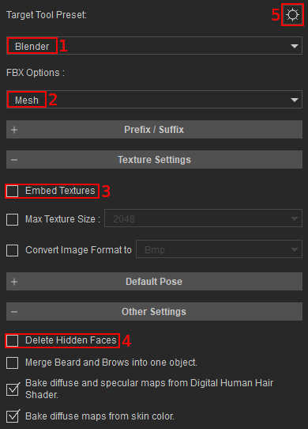
                        
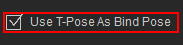

.. list-table::
   :widths: 3 2
   :header-rows: 0

   * - |BasicSettingsImg|
     - - **Required Settings:** |br2|

       1. **Blender** as the target tool preset. |br2|

       2. **Mesh** *only* as the FBX option. |br2|

       3. **Embed Textures** must be *unchecked*. |br2|

       4. **Delete Hidden Faces** must be *unchecked*. |br2|

       5. **Advanced Settings** - one advanced setting must also be made (see below).
   * - |SingleAdvImg|
     -  - The single setting that needs to be made in the **Advanced Settings** is to check T-Pose as Bind Pose. |br2|

        - All other settings should be inherited from the 'Blender' tool preset specified in the basic settings.

.. |AdvSetA| image:: images/adv_set_a.png
    

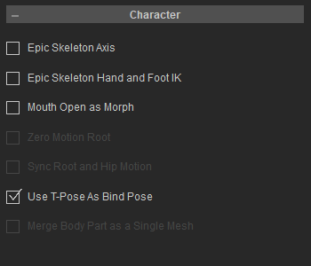
    

.. |AdvSetC| image:: images/adv_set_c.png
    

.. |AdvSetD| image:: images/adv_set_d.png
    :width: 222

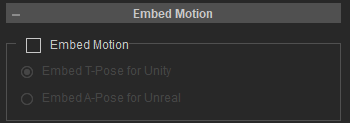

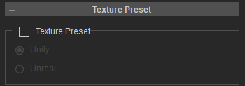

As a quick reference, the following settings should be (automatically) set in the advanced settings. 

.. list-table::
   :widths: 1 1 1
   :header-rows: 0

   * - |AdvSetA|
     - |AdvSetB|
     - |AdvSetC|
   * -  - **General Settings**

        - Z-Axis

        - Auto Skin Rigid Mesh

        - Reset Self Illumination

        - Export JSON
     -  - **Character Settings**

        - Use T-Pose as Bind Pose
     -  - **Texture and UV**

        - UDIM

        - Export Vertex Color
   * - |AdvSetD|
     - |AdvSetE|
     - |AdvSetF|
   * -  - **Normal Settings**

        - OpenGL (Y+)
     -  - **Embed Motion**

        - **No** Embed Settings
     -  - **Texture Preset**

        - **No** Texture Preset

