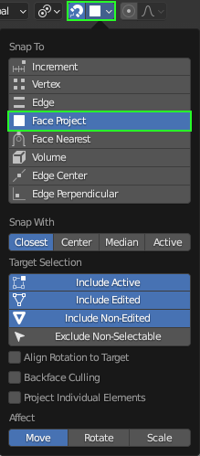

.. _Dynamic Bone: https://assetstore.unity.com/packages/tools/animation/dynamic-bone-16743

.. _Magica Cloth 2: https://assetstore.unity.com/packages/tools/physics/magica-cloth-2-242307

.. _CC4 Blender Tools Plugin: https://github.com/soupday/CC4-Blender-Tools-Plugin

.. _CC/iC Blender Tools: https://github.com/soupday/cc_blender_tools

.. _Grease Pencil: https://docs.blender.org/manual/en/latest/grease_pencil/index.html

.. _annotation layers: https://docs.blender.org/manual/en/latest/interface/annotate_tool.html#annotation-layers

.. _HumanBone: https://docs.unity3d.com/ScriptReference/HumanBone.html

.. |br2| raw:: html

   <br /><br />

.. |br| raw:: html

   <br />


###################
Spring Bone Rigging
###################

Spring Bones are a convenient means of adding physics elements to a character.  When used in a real time engine such as **Unity**, they offer a performance friendly means of doing real-time physics simulation that would otherwise be detrimental to performance.

The examples discussed below involve the use-case of: 

*Setup*

- Import of a character with a hairstyle from Character Creator.
- The addition of weighted bones in Blender to control parts of the hair.

*Usage*

- Exort of the character along with the spring bones to Unity for usage with either the `Dynamic Bone`_ or `Magica Cloth 2`_ add-ons for physics simulation.
- Re-Export of the spring bones back to Character Creator (with some significant limitations).  *Please note* that whilst Dynamic Bone will only do spring bone simulation, Magica Cloth will do both Spring Bone *and* Cloth simulation and as such, offers a high performance alternative to the built in Unity Cloth Physics.

*Further Usage*

- Spring bones can also be utilized in Blender where the physics simulation utilizes a 'Rigid Body World' type simulation; please see the :ref:`Spring Bone Usage In Blender` section of the documentation for more details.

 

Blender Spring Bone Workflow
============================

Preparation and Import
----------------------

- Prepare a suitable character in Character Creator which contains objects you wish to perform spring bone physics simulation on (in **Unity**).


    *Example character with a ponytail hairstyle*  

- **To setup spring bones for Unity:** Export the character using the :ref:`CC4 Blender Tools Plugin` add on for CC4 (see link for details; The plugin is available here `CC4 Blender Tools Plugin`_) using the :ref:`Round Trip Export For Unity` export options.

.. figure:: images/cc-spring-export-dia.png
    :align: center

    *Round trip export options for Unity destination*

- **To setup spring bones for Character Creator:**  Export the character using the :ref:`CC4 Blender Tools Plugin` add on for CC4 (see link for details; The plugin is available here `CC4 Blender Tools Plugin`_) using the :ref:`Blender Round Trip Workflow` export options. |br2|


- Import the character into Blender with the `CC/iC Blender Tools`_  using the :ref:`Standard Import` procedure.

- Once the character is imported, then new bones can be added with the tools in the 'Spring Rig' panel of the **'CC/iC Create'** tab of the `CC/iC Blender Tools`_.

.. image:: images/bl-spring-rig-pane.png
    :align: center

|

Creating the 'Spring Rig'
-------------------------

The 'Spring Rig' is essentially an extension of the existing character skeleton which when complete will only exert influence on the hair objects of the character.

The end use target application for the spring bones can currently be either **Character Creator** or **Unity** (A spring bone solution for dynamic animation in Blender is currently WIP).  The correct end-use case should be set using the 'Hair Spring Rig' switch in the 'Spring Rig' pane of the **'CC/iC Create'** tab.


|br| Three principal methods for adding new bones to the character are available:

.. |bones_from_card|  image:: images/bl-bones-from-card.png


.. |bones_custom|  image:: images/bl-bones-custom.png

.. |bones_from_card_txt| replace::
    **Hair Card Method:** Spring Bones are programmatically added to individual 'Hair Cards' (i.e. individual polygon strips that are commonly used to represent groups of individual hairs in 3D hair models).

.. |bones_from_pencil_txt| replace::
    **Grease Pencil Method:** Spring Bones are programmatically added that follow the path of lines drawn on the model surface with the Blender `Grease Pencil`_.

.. |bones_custom_txt| replace::
    **Custom Placement Method:** Bones can be added (again as part of the character skeleton) and subsequently positioned and extended by hand. 

.. list-table::
        :widths: 2 5
        :header-rows: 0
        :align: center

        * - |bones_from_card|
          - |bones_from_card_txt|
        * - |bones_from_pencil|
          - |bones_from_pencil_txt|
        * - |bones_custom|
          - |bones_custom_txt|


All of these methods can be used simultaneously, should you wish to. The structure of the hair mesh is perhaps the largest determining factor in which method to use.

- If the hair mesh contains obvious and clearly defined hair cards, then adding bones to individual hair cards will be a simple process.  

.. |cc_card|  image:: images/cc-hair-card-type.png
    :width: 300


.. |cc_pencil| image:: images/cc-pencil-type.png
    :width: 300

.. |bl_pencil|  image:: images/bl-pencil-type.png
    :width: 300

.. |cc_card_txt| replace::
    Character Creator hairstyle containing hair cards.

.. |bl_card_txt| replace::
    Blender view with very clearly defined hair cards. **Suitable for the 'Hair Card' method**.

.. |cc_pencil_txt| replace::
    Character Creator hairstyle with a dense mesh (made from hair cards).

.. |bl_pencil_txt| replace::
    Blender view of the mesh with a higher density hair card structure. **Suitable for the 'Grease Pencil' method**.


.. list-table::
        :widths: 2 2
        :header-rows: 0
        :align: center

        * - |cc_card|
          - |bl_card|
        * - |cc_card_txt|
          - |bl_card_txt|


- On the other hand if any hair cards are poorly defined (or absent), then use of the grease pencil will be more productive. 


.. list-table::
        :widths: 2 2
        :header-rows: 0
        :align: center

        * - |cc_pencil|
          - |bl_pencil|
        * - |cc_pencil_txt|
          - |bl_pencil_txt|

- Trianglulated meshes can present some problems in determining how to place any spring bone chains, since the 'direction' of the hair can only be estimated from the mesh.  This may require initial placement with the grease pencil or manual placement, followed by manual adjustment as needed by the mesh.


Hair Card Method: Basic workflow
````````````````````````````````
- |bones_from_card|  

The principal requirement for adding bones to hair cards is that you must enter '**Edit Mode**' for the hair object and use '**Face Selection Mode**'.  So the (highlighted) icons below should be shown at the top of the viewport window.

.. image:: images/bl-edit-face-select.png
    :align: center

|

- In Edit Mode + Face Selection Mode, simply select one face on the hair card:

.. figure:: images/bl-edit-face-selected-card.png
    :align: center
    :width: 300

    *Single face selected on the hair card*


- Set the parameters for the desired *Bone Length* (shorter lengths will create more bones to fill out the length of the hair card); *Skip Length* the distance from the start of the hair card that you want the initial bone to be placed at; *Truncate Length* the distance from the *end* of the hair card to *stop* generating bones; *Smoothing Steps* how much smoothing to apply to the curve generated from the grease pencil stroke or the actual hair card.


|

- Press the 'Bones from Cards' |bones_from_card| button to add a set of spring bones along the hair card using the above parameters for bone length and initial positioning.

.. figure:: images/bl-edit-face-added-bone-card.png
    :align: center
    :width: 300

    *Spring Bones added along the hair card*

- Should you wish to adjust the parameters, then (with the hair card still selected) simply edit the values as needed and click on 'Bones from Cards' and the spring bones will be recreated with the new parameter values.

- Bones, bone weights and even grease pencil marks may also be easily removed using the 'Clear' buttons - this can be specifically performed for either 'All Bones/Cards' or 'Selected Bones/Cards' using the provided selection toggles.  The last added bones are automatically selected by default - to change or extend the selection then enter 'Edit Mode' for the bone object and select any single bone of a spring bone chain to include it in the selection.  Hair cards must also be selected/deselected in 'Edit Mode'. 


.. figure:: images/clear-functions.png
    :align: center

    *'Clear' Buttons*


    
..
    .. |clear_all_txt| replace::
        Clear ALL added spring bones. 

    .. |clear_sel| image:: images/bl-clear-sel.png

    .. |clear_sel_txt| replace::
        Clear ONLY SELECTED spring bones. 

    .. list-table::
            :widths: 1 1
            :header-rows: 0
            :align: center

            * - |clear_all|
            - |clear_sel|
            * - |clear_all_txt|
            - |clear_sel_txt|


Spring Bones can be added to as many or few hair cards as you require (you **DO NOT** need to to add bones to every hair card).

Grease Pencil Method: Basic Workflow
````````````````````````````````````
- |bones_from_pencil|

Using the grease pencil method to add bones to the 'spring rig' is extremely simple.  The basic requirement is that a single stroke (line) is drawn on the surface of the model to represent each bone chain that will be added.  Any number of bone chains can be added by this method.

- In order to draw a grease pencil stroke onto the surface of the model, you must be in 'Object Mode' and the 'Grease Pencil - Annotate' tool active (set in the left hand side tool bar)


    *Grease Pencil - Annotate mode*

- In the grease pencil tool strip at the top of the viewport set the 'Placement' to 'Surface' and check the 'Stabilize Stroke' box.


    *Grease Pencil - Settings*

.. |grease_button| image:: images/grease_button_active.png

.. tip::
    The grease pencil can be easily activated with the above settings by clicking on the grease pencil icon |grease_button| (shown highlighted) in the mini tool strip of the spring rig pane.

    Once you are finished with the grease pencil, then click the button again to deactivate it.  This return the active tool to 'Select Box'.


- draw a stroke onto the model in the position that you want to place a chain of bones

.. figure:: images/bl-drawn-grease-stroke.png
    :align: center

    *Drawn Grease Pencil Stroke*

- After drawing the stroke you have the opportunity to change the color of the stroke by clicking on the 'Annotation' color in the grease pencil tool strip.

.. figure:: images/bl-grease-annotation-color.png
    :align: center

    *Annotation Color Settings*

- The drawn stroke can now be converted into a chain of bones according to the parameters for the desired Bone Length (shorter lengths will create more bones to fill out the length of the hair card) and Skip Length: the distance from the start of the hair card that you want the initial bone to be placed at.


|

- Press the 'Bones from Cards' |bones_from_pencil| button to add a set of spring bones along the grease pencil stroke using the above parameters for bone length and initial positioning.

.. figure:: images/bl-grease-added-bone-chain.png
    :align: center

    *Bone chain added along grease pencil mark*

After the addition of the bone chain, the grease pencil stroke can be removed and a new one drawn to continue the bone adding process.

.. tip::
    Any generated bones can easily be repositioned in 'Edit Mode' if the auto-generated position is for any reason unacceptable.

 
Grease Pencil Method: Advanced Workflow
```````````````````````````````````````

The grease pencil can be used in a more sophisticated way where multiple annotations can be placed in their own `annotation layers`_ or 'Notes' and then the bones can be generated for selected layers.  This avoids either having to remove exiting grease pencil strokes when using different settings for different bones.

The annotation layers can be accessed as follows:

- Activate the annotation tool when in object mode.


    *Grease Pencil - Annotate mode*

- In the grease pencil tool strip at the top of the viewport set the 'Placement' to 'Surface' and check the 'Stabilize Stroke' box.

- Draw the initial stroke onto the model (this step will allow access to annotation layers).

- After the first stroke is drawn, a 'Note' dropdown menu will appear in the top tool strip - click that to manage the annotation layers. 


|

- The annotation layers can also be managed from the 'Active Tool' pane of the sidebar 'Tool' tab (accessed by pressing the **N** key).


|

- Add a new layer to the annotations with the '+' button. Each layer can have a different color if desired.

.. image:: images/bl-new-annotate-layer.png
    :align: center

|

- With the new layer selected, new strokes can be drawn onto the model.

- The |bones_from_pencil| button will now only generate bone chains for grease pencil strokes that are in the currently selected layer.


grease pencil annotation layers - work in object mode so the bones can be selected
discuss the selection toggles and their power - quick access to notes

Custom Placement Method: Basic workflow
```````````````````````````````````````
- |bones_custom|

A custom bone may be added at any time (in *Edit Mode* or *Object Mode*) by clicking on the 'Add Custom Bone' button. This will immediately enter edit mode for the skeleton and only display the spring rig bones (the original main skeleton bones are in a layer whose visibility is toggled off) along with the character. The newly added bone will be automatically selected.

.. figure:: images/bl-added-custom-bone.png
    :width: 176
    :align: center

    *Newly added bone*

To conveniently position the bone on the character, use 'Face Project' snapping (selected from the top bar snapping tool)



    *Face Project snapping*

Now when selecting and dragging the bone tips, they should snap to the projected surface of the character. Extending the bone chain with **E** will then allow easy positioning on the model surface.

.. figure:: images/bl-snapped-extended-bones.png
    :width: 196
    :align: center

    *Extended bone chain placed with surface snapping*

Bone Visibility
_______________

.. |visibility| image:: images/vis-toggle.png

.. |envelope| image:: images/vis-envelope.png

The visibility of the added spring bones and the original skeleton bones can be toggled through use of the visibility toggle |visibility|. The appearance of the bones can be cycled through using the bone style button |envelope|.


Weight Painting the Spring Rig
------------------------------

.. Note:: 
    Before beginning weight painting, please ensure that the correct end-use case is set using the 'Hair Spring Rig' switch in the 'Spring Rig' pane.

    .. image:: images/cc4-unity-switch.png
        :align: center

Once the bones have been added to the spring rig, their influence can be automatically weight painted onto the appropriate hair mesh (or meshes) using the 'Bind Hair' button (with the hair object or objects selected).


|

.. Tip::
    In the case of a single hair object, then that object must be selected in 'Object Mode' before pressing 'Bind Hair'.  When there are multiple hair objects, then each object that you wish to paint influence onto must be multiple selected (shift + select) before using 'Bind Hair'.

.. Note::
    Since the weight painting is done programmatically, the algorithm used can identify the hair card structure and weight paint the bone influences in such a way that **the hair cards will not be stretched when deformed**.  This will greatly minimize stretching distortion and look much more like real hair.


The selected hair object will be weight painted according to the user defined parameters below:

.. |bind-params| image:: images/bl-bind-hair-params.png

.. |bind-radius| replace::
    **Bind Radius** - How wide a radius around the bones should the hair cards bind vertex weights to.

.. |bind-bones| replace::
    **Bind Bones** - How many neighboring bones should each hair card bind to. Note: More bones may produce smoother results but add to the overall mesh skinning performance cost.

.. |weight-scale| replace::
    **Weight Scale** - How much to scale the generated weights by. 

.. |weight-curve| replace::
    **Weight Curve** - How to fade in the bone weights of each hair card from root to ends. Larger values ( > 1.0) will push the weights down closer to the ends. Smaller values ( < 1.0) will push the weights up closer to the roots"

.. |weight-var| replace::
    **Weight Variance** - How much random variation in the generated weights. Less variance will cause all the hair cards to the follow the bones more closely. More variance will cause a wider spread of the cards as the bones move which gives the appearance of more volume.

.. |smoothing| replace::
    **Smoothing** - How much to smooth the generated weights after binding

.. |random-seed| replace::
    **Random Seed** - The random seed for generating the weight variance. The same seed should produce the same results each time.

.. |scale-body| replace::
    **Scale Body Weights** - How much to scale any existing body weights on the hair. 
    **Note:** The spring bones vertex weights will compete with the body vertex weights. 
    Scaling the body weights back (< 1.0) will allow the hair to follow the spring bones more closely but will then conform less to the body.
    
.. |scale-body2| replace::
    **Warning:** This change will permanently alter the original body weights on the hair meshes. 
    After binding, this value resets to 1.0 to prevent successive weight scaling.
    Setting this to zero will remove all body and other weights from the hair mesh.

.. list-table::
        :widths: 2 8
        :header-rows: 0
        :align: center

        * - |bind-params|
          - |bind-radius|
            |br2|
            |bind-bones|
            |br2|
            |weight-scale|
            |br2|
            |weight-curve|
            |br2|
            |weight-var|
            |br2|
            |smoothing|
            |br2|
            |random-seed|
            |br2|
            |scale-body|
            |br2|
            |scale-body2|

After binding, the bones will be shown in 'Pose Mode' where the results of the binding can be explored. The binding results can be best seen if you set the 'Transform Pivot Point' to Individual Origins (shown below). When rotating, this setting will obey the connectivity of the selected bones in the chain and effectively cause the chain to 'curl' as opposed to moving as one static object. 


    
|

It is recommended that for each bone chain created, select all the bones (in 'Pose Mode' select one bone then press Shift + L to select all linked) and rotate them (**R** key - and restrict axes with the x,y or z  keys) to see the subsequent mesh deformation.

.. figure:: images/bound-bone-rotate.gif
    :align: center
    :width: 289

    *Hair deformation with single bone chain (single sample viewport)* 

Weighting Variance
------------------

The 'Weight Variance' value used in the hair binding can have a very pronounced effect.  This weight paints each hair card slightly differently, so that any bone movement will have a different effect on each 'strand' or rather 'group of strands'.

.. Note::
    Individual hair cards are programmatically weight painted with equal weights laterally across the width of the card - so that they aren't stretched by bone movement. When combined with each card being painted differently, this produces a very natural looking range of motion of groups of hair strands (represented by a hair card).  

- A low 'Weight Variance' value will produce a weighting where all of the hair cards are similarly weighted and mill be 'moved together' by the deforming bones.

- A high 'Weight Variance' value will produce a weighting where the hair cards are weighted very differently, meaning that they will be moved quite differently from each other by the deforming bones.

.. |low-var-gif| image:: images/low-variance-binding.gif

.. |high-var-gif| image:: images/high-variance-binding.gif

.. |low-var-txt| replace::
    Low Variance (0.05) - All of the hair cards move together as the bone chain deforms the mesh.

.. |high-var-txt| replace::
    High Variance (0.95) - The hair cards are now moved to differing extents (without stretching) as the bone chain deforms the mesh.

.. list-table::
        :widths: 1 1
        :header-rows: 0
        :align: center

        * - |low-var-gif|
          - |high-var-gif|
        * - |low-var-txt|
          - |high-var-txt|

The video below is a render of the spring bone simulation with a single spring bone chain deforming the ponytail - being acted on by a variable force field.  The hair is weighted to the bone chain with a weight variance of 0.75 (default). *This illustrates that quite complex and subtle motion can be created even when only a single bone chain is being used*.

.. |vid| raw:: html

    <video width="695" controls loop = true muted = true src="_static/weight variance example.mp4"></video> 

|vid|


Exporting to Unity
------------------

Prior to 'Rigifying' the character, export of the character + spring rig can be performed using the 'Export to Unity' button in the Import/Export foldout of the CC/iC Pipeline Tab. This allows :ref:`Exporting as a .Blend file` or :ref:`Exporting as FBX` (follow the links for the relevant documentation sections).

After 'Rigifying', the character + spring rig can only be exported using the Mesh/Motion Export function - outlined in the :ref:`Exporting after Rigify` section of the documentation. This will produce a Unity compatible export.

In the case of a character which has simply had a 'spring rig' created & weighted, and then exported: The exportted character + spring bone rig can be used in unity provided that the  `Dynamic Bone`_ package is installed into the Unity project.

..
    In the :ref:`Spring Bone Usage In Blender` section, the procedure to bake a dynamic spring bone simulation into an (nla) animation track is described; the export of this baked nla animation of the spring rig can also now be used by unity.

    The Unity Mechanim animation system uses its own 'Mechanim human anatomy' and creates an Avatar which contains a mapping between the actual model skeleton and the conceptual bones in the 'Mechanim human anatomy' (referred to at API level as `HumanBone`_).  Imported animations are internally converted to animate only the Mechanim bones of the avatar (and the HumanBone mapping used to drive the actual skeleton).  Thus, any imported animation can be played on a different skeleton without the need for any re-targeting.

    Generally when a humanoid model is imported, any animation data that refers to bones that are not included in the unity humanoid skeleton will be lost; the 2 solutions to this are:

    - The default Unity method would be to use the imported character as generic rather than humanoid however this limits the ability to play other (normal humanoid) animations on the character since it no longer contains the Mechanim HumanBone references.

    - The alternative method now provided by the Unity addon is: To extract the extra bone animation data from the generic skeleton and add it to the converted mechanim humanoid animation.  This step can be performed automatically as part of the import process (the specifics are subject to change) without any need for user intervention.

Exporting back to Character Creator
-----------------------------------

Returning a character with added spring bones to CC4 can have some significant complicating factors.

- When returned to CC4, the hair rig is treated as a separate accessory object.  This separate object is pinned to its original position on the character.

- The accessory object will no longer obey deformation from the original skeleton; only deformation from the hair rig.

- The hair may then be deformed in unpredictable ways, most likely resulting in unacceptably poor positioning of the hair.

.. Tip::
    If you wish to have any part of a character's hair governed by spring bones, then limit those parts to already separate objects which do not move dynamically - such as a Ponytail.


