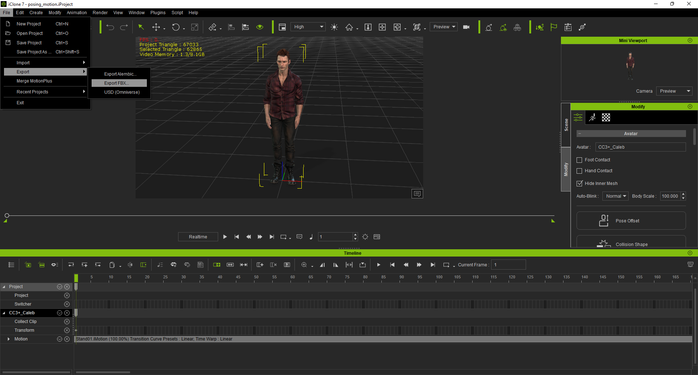
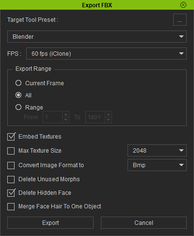
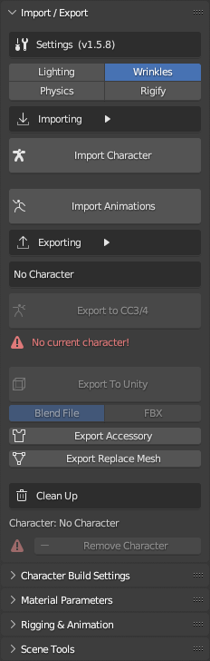
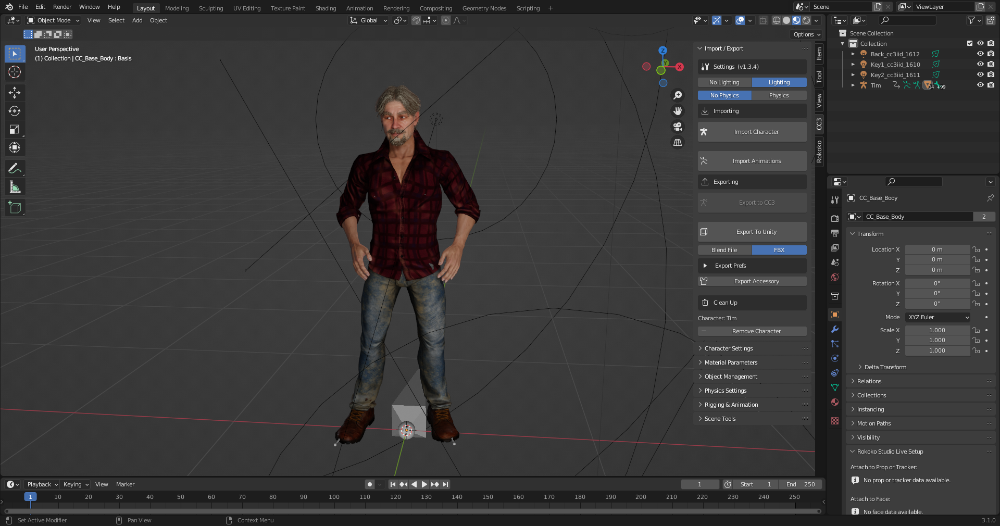
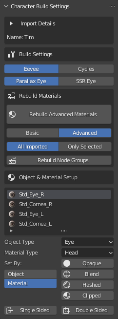
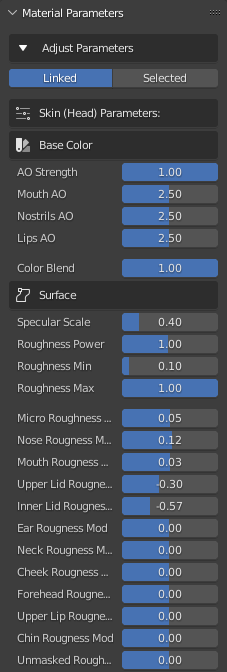

~~~~~~~~~~~~~
 Basic Usage
~~~~~~~~~~~~~

Export Settings From Character Creator or iClone
================================================

Character Creator
-----------------

In character creator, make any character you like and dress them up.

.. image:: images/ex1_cc3_char.jpg
  :width: 600

Export the character as **FBX (Clothed Character)**. Set the target tool preset to **Blender**, The FBX options to **Mesh and Motion**.
You can Embed the textures if you want, but it's usually better not to as embedding the textures stores them in the FBX file where you can't access them if you need to. Set the Include Motion to **Current Pose** and tick **Delete Hidden Faces**.

.. image:: images/ex1_export_fbx.jpg

|

iClone
------

In iClone, select the character you wish to export and use the menu option **File -> Export -> Export FBX**

Set the target tool to **Blender** the animation range to whatever you need (set to **All** if in doubt).  Leave the default selection of **Embed Textures** and **Delete Hidden Faces**.

|

Import into Blender
===================

Standard Import
---------------

.. admonition:: Important

    **Do Not** use the standard blender FBX importer to import characters from iClone or Character Creator. You will encounter all of the numerous problems which initially prompted the creation of this add-on.
    
    Instead follow the method below.

In Blender and with a new Blend file, you may need to delete the default cube. Press **N** to show the tools panel and select the **CC/iC Pipeline** Tab. Select the desired **Lighting** option and then import the character by pressing the **Import Character** button under the *Importing* header of the **Import/Export panel**.

Navigate to where you saved the exported the character from Character Creator or iClone, **select the file** and **click the import button**.  Should you wish to import animations, then leave the *Import Animation* checkbox active in the *file view* where you navigate to the fbx to import.

This will import the character, set up the materials and (if the **Lighting** setting is enabled) set up some lighting similar to Character Creators default lighting to better view the character in the viewport.

- You can hide the Armature if it's getting in the way.

|

Character Settings Panel
------------------------

In the **Character Settings** panel you can control the way the add-on builds the materials.

Materials can be specifically built for either the Cycles or Eevee renderer, and the type of eye shader can be defined according to your needs.

- **Parallax Eyes** use a single cornea material which is not subject to the Eevee engine's limitations on sub surface scattering and the receiving of shadows.

- **SSR Eyes** (Screen Space Refraction) use a transparent cornea material over an opaque eye (iris) material.  When using Eevee, SSR materials do not receive shadows and do not have subsurface scattering.

Please see the :ref:`Eye Refraction` section for more information.

Select any imported object to quickly adjust the build object type and material type for any object material.

The add-on attempts to detect the type and purpose of each object and material by analyzing the object and material names for certain keywords. Sometimes it gets this process wrong if the objects or materials have ambiguous names, but the detected settings can be corrected:

- The **Object Type** allows you to specify what type of object and thus how to build the materials for that object.

- The **Material Type** similarly allows you to specify what type of material.

These two settings will allow you to correct any mis-detected materials in the import. Typically only hair and clothing meshes will be (occasionally) wrongly detected.

The **Basic** and **Advanced** material options determine whether a standard PBR shader is used (i.e. BSDF) or a more complex shader.

Once changes have been made to any of the above the **Rebuild Advanced Materials** button must be used to update the materials with the new settings.

The **Rebuild Node Groups** button will rebuild the shaders in line with the current version of the add-on.  This can be used in cases where you have an old .blend file created with an earlier version of the add-on and you wish to update the shaders to the latest version.  Or you can use it to reset any changes you may have made to the shaders. In either case, after performing a **Rebuild Node Groups** you must then use **Rebuild Advanced Materials** to complete the process.

Selection of a material in the **Object and Material Setup** pane will show all of the available settings in the **Material Parameters** panel (in much the same way as selection of  the material in the Material Properties tab of the standard Properties panel would).

|

Material Parameters Panel
-------------------------

In the **Material Parameters** panel you can control how the various textures of the character interact and mix together to form the final appearance of the character. Each parameter can be adjusted and the materials will update in real time as you change the parameter sliders. For the most part these parameters take the same values as the material shader parameters in Character Creator.

The parameters displayed are context sensitive to the currently active selected object and material. Full details of the material parameters can be found here: :doc:`materials`.

Make any adjustments you wish to - these settings can all be revisited at any time.